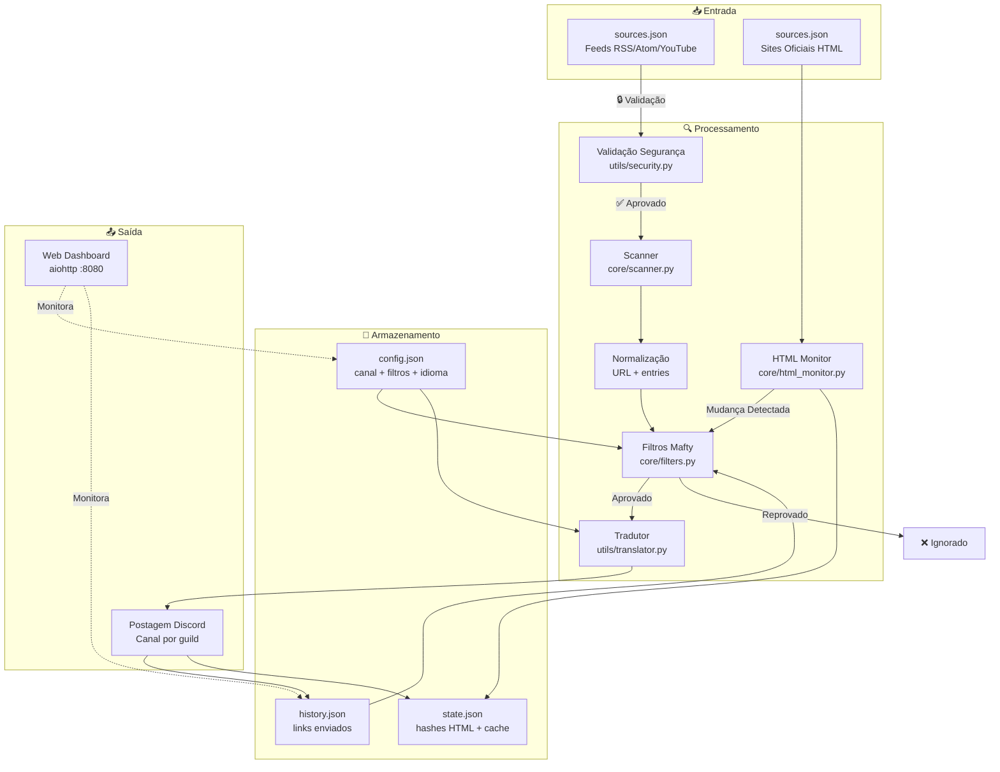
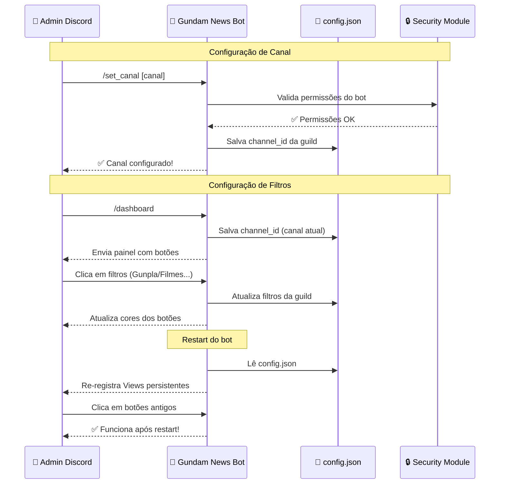
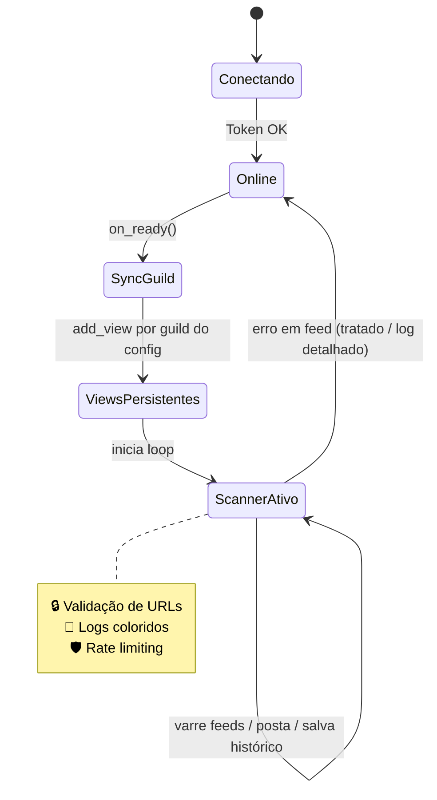
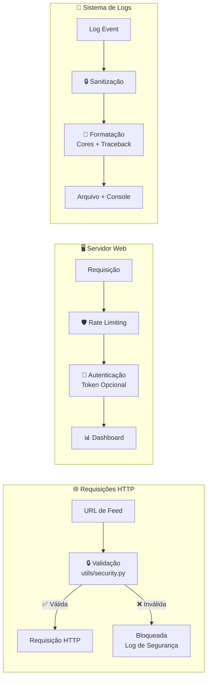
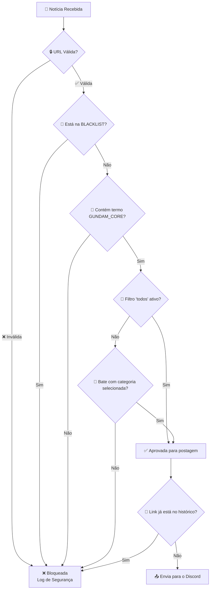

# 🛰️ Gundam News Bot — Mafty Intelligence System

<p align="center">
  
</p>

<p align="center">
  <a href="https://github.com/carmipa/gundam-news-discord/actions/workflows/python-app.yml">
    
  </a>
  
  
  
  
  
  
</p>

<p align="center">
  <b>Monitoramento inteligente de feeds RSS/Atom/YouTube sobre o universo Gundam</b><br>
  Filtragem cirúrgica • Dashboard interativo • Postagem automática no Discord<br>
  <i>🔒 Segurança aprimorada • 📊 Logs detalhados • 🛡️ Proteção anti-SSRF</i>
</p>

---

## 📋 Índice

- [✨ Funcionalidades](#-funcionalidades)
- [🔒 Segurança e GRC](#-segurança-e-grc)
- [🧱 Arquitetura](#-arquitetura)
- [🚀 Instalação](#-instalação)
- [⚙️ Configuração](#️-configuração)
- [🧰 Comandos](#-comandos)
- [🎛️ Dashboard](#️-dashboard)
- [🧠 Sistema de Filtros](#-sistema-de-filtros)
- [🖥️ Deploy](#️-deploy)
- [📊 Monitoramento e Logs](#-monitoramento-e-logs)
- [🧩 Troubleshooting](#-troubleshooting)
- [📜 Licença](#-licença)

---

## ✨ Funcionalidades

| Feature | Descrição |
|---------|-----------|
| 📡 **Scanner Periódico** | Varredura de feeds RSS/Atom/YouTube a cada 30 minutos (configurável) |
| 🕵️ **HTML Watcher** | Monitora sites oficiais sem RSS (ex: Gundam Official) detectando mudanças visuais |
| 🎛️ **Dashboard Persistente** | Painel interativo com botões que funciona mesmo após restart |
| 🎯 **Filtros por Categoria** | Gunpla, Filmes, Games, Música, Fashion + opção "TUDO" |
| 🛡️ **Anti-Spam** | Blacklist para bloquear animes/jogos não relacionados a Gundam |
| 🔄 **Deduplicação** | Nunca repete notícias (histórico em `history.json`) |
| 🌐 **Multi-Guild** | Configuração independente por servidor Discord |
| 📝 **Logs Coloridos** | Sistema de logging avançado com cores e traceback detalhado |
| 🎨 **Embeds Ricos** | Notícias com visual premium (cor Gundam, thumbnails, timestamps) |
| 🎞️ **Player Nativo** | Vídeos do YouTube/Twitch tocam direto no chat (sem abrir navegador) |
| 🌍 **Multi-Idioma** | Suporte a EN, PT, ES, IT, JA (detecção automática + `/setlang`) |
| 🖥️ **Web Dashboard** | Painel visual em <http://host:8080> com status em tempo real |
| 🧹 **Auto-Cleanup** | Limpeza automática de cache a cada 7 dias para performance (Zero manutenção) |
| ❄️ **Cold Start** | Posta imediatamente as 3 notícias mais recentes de novas fontes (ignora travas) |
| 🔐 **SSL Seguro** | Conexões verificadas com certifi (proteção contra MITM) |
| 🔒 **Validação de URLs** | Proteção anti-SSRF (Server-Side Request Forgery) |
| 🛡️ **Rate Limiting** | Proteção contra abuso de comandos e servidor web |
| 🔐 **Autenticação Web** | Servidor web protegido com token (opcional) |

---

## 🔒 Segurança e GRC

### Melhorias de Segurança Implementadas

| Recurso | Status | Descrição |
|---------|--------|-----------|
| 🔒 **Validação de URLs** | ✅ | Bloqueia IPs privados e domínios locais (anti-SSRF) |
| 🛡️ **Rate Limiting** | ✅ | Limite de requisições por IP no servidor web |
| 🔐 **Autenticação Web** | ✅ | Token opcional para acesso ao dashboard web |
| 📝 **Sanitização de Logs** | ✅ | Informações sensíveis são mascaradas automaticamente |
| 🔒 **Headers de Segurança** | ✅ | CSP, X-Frame-Options, X-Content-Type-Options |
| ✅ **Validação SSL** | ✅ | Certificados verificados com certifi |
| 🚫 **Tratamento de Erros** | ✅ | Exceções específicas com contexto detalhado |

### Análise de Segurança

📄 **Documentação completa:** Veja [SECURITY_GRC_ANALYSIS.md](SECURITY_GRC_ANALYSIS.md) para análise detalhada.

**Principais melhorias:**
- ✅ Validação de URLs antes de fazer requisições HTTP
- ✅ Rate limiting em comandos críticos e servidor web
- ✅ Sanitização automática de logs (tokens, senhas)
- ✅ Tratamento específico de exceções com contexto
- ✅ Headers de segurança HTTP configurados

---

## 🧱 Arquitetura

### 1) Visão Macro — Fluxo Completo de Dados



> **Legenda:**
>
> - `sources.json` — Lista de feeds monitorados
> - `config.json` — Configuração de canal e filtros por servidor
> - `history.json` — Links já enviados (deduplicação)
> - `state.json` — Estado de cache HTTP e hashes HTML
> - 🔒 **Validação de Segurança** — Anti-SSRF e validação de URLs

---

### 2) Fluxo do Comando `/set_canal` e `/dashboard`



> **Destaques:**
>
> - `/set_canal` — Comando dedicado para configurar canal rapidamente
> - `/dashboard` — Painel completo com filtros e configurações
> - Botões funcionam **mesmo após restart** do bot
> - Configuração é **salva em disco** automaticamente

---

### 3) Estados Principais do Bot



> **Ciclo de vida:**
>
> 1. **Conectando** — Validando token
> 2. **Online** — Conectado ao Discord
> 3. **SyncGuild** — Sincronizando comandos slash
> 4. **ViewsPersistentes** — Restaurando botões do dashboard
> 5. **ScannerAtivo** — Loop de varredura rodando com segurança

---

### 4) Arquitetura de Segurança



---

## 🚀 Instalação

### Pré-requisitos

- Python 3.10 ou superior
- Token de bot do Discord ([Portal de Desenvolvedores](https://discord.com/developers/applications))
- Git (para clonar o repositório)

### Passo a passo

```bash
# 1. Clone o repositório
git clone https://github.com/carmipa/gundam-news-discord.git
cd gundam-news-discord

# 2. Crie ambiente virtual
python -m venv .venv

# Windows
.venv\Scripts\activate

# Linux/macOS
source .venv/bin/activate

# 3. Instale dependências
pip install -r requirements.txt

# 4. Configure o ambiente
cp .env.example .env
# Edite o .env com seu token
```

### 🐳 Instalação com Docker (Recomendado)

```bash
# Clone o repositório
git clone https://github.com/carmipa/gundam-news-discord.git
cd gundam-news-discord

# Configure .env
cp .env.example .env
nano .env  # Adicione seu DISCORD_TOKEN

# Inicie com Docker Compose
docker-compose up -d

# Ver logs
docker-compose logs -f
```

📖 **Guia completo de deploy:** Veja [DEPLOY.md](DEPLOY.md) para instruções detalhadas.

---

## ⚙️ Configuração

### Variáveis de Ambiente (`.env`)

```env
# ⚠️ OBRIGATÓRIO
DISCORD_TOKEN=seu_token_aqui

# ⚙️ OPCIONAL
COMMAND_PREFIX=!
LOOP_MINUTES=30
LOG_LEVEL=INFO  # Use DEBUG para logs detalhados

# 🔒 Segurança do Servidor Web (Opcional)
WEB_AUTH_TOKEN=seu_token_secreto_aqui  # Recomendado para produção
WEB_HOST=127.0.0.1  # 127.0.0.1 = apenas localhost, 0.0.0.0 = todos os IPs
WEB_PORT=8080
```

> **🔒 Segurança:** Configure `WEB_AUTH_TOKEN` em produção para proteger o dashboard web!

### Fontes de Feeds (`sources.json`)

O bot aceita múltiplos formatos:

<details>
<summary><b>📁 Formato com categorias (recomendado)</b></summary>

```json
{
  "rss_feeds": [
    "https://www.animenewsnetwork.com/news/rss.xml",
    "https://gundamnews.org/feed"
  ],
  "youtube_feeds": [
    "https://www.youtube.com/feeds/videos.xml?channel_id=UCejtUitnpnf8Be-v5NuDSLw"
  ],
  "official_sites_reference_(not_rss)": [
    "https://gundam-official.com/",
    "https://en.gundam-official.com/news"
  ]
}
```

</details>

<details>
<summary><b>📁 Formato lista simples</b></summary>

```json
[
  "https://www.animenewsnetwork.com/news/rss.xml",
  "https://gundamnews.org/feed"
]
```

</details>

---

## 🧰 Comandos

### 🔧 Comandos Administrativos

| Comando | Descrição | Uso |
|---------|-----------|-----|
| `/set_canal` | Define o canal onde o bot enviará notícias | `/set_canal [canal:#noticias]` |
| `/dashboard` | Abre painel visual para configurar filtros | `/dashboard` |
| `/setlang` | Define o idioma do bot para o servidor | `/setlang idioma:pt_BR` |
| `/forcecheck` | Força uma varredura imediata de feeds | `/forcecheck` |
| `/clean_state` | Limpa partes do state.json (com backup automático) | `/clean_state tipo:dedup confirmar:sim` |

### 📊 Comandos Informativos

| Comando | Descrição | Uso |
|---------|-----------|-----|
| `/status` | Mostra estatísticas do bot (Uptime, Scans, etc) | `/status` |
| `/feeds` | Lista todas as fontes monitoradas | `/feeds` |
| `/help` | Mostra manual de ajuda completo | `/help` |
| `/ping` | Verifica latência do bot | `/ping` |
| `/about` | Informações sobre o bot | `/about` |

> **🔒 Permissão:** Apenas administradores podem usar comandos administrativos.

### 📖 Exemplos de Uso

#### Configuração

```bash
# Configurar canal rapidamente
/set_canal                    # Usa o canal atual
/set_canal canal:#noticias    # Define canal específico

# Abrir dashboard completo
/dashboard                    # Abre painel com filtros

# Definir idioma
/setlang idioma:pt_BR         # Português
/setlang idioma:en_US         # Inglês
```

#### Manutenção

```bash
# Limpar state.json (requer confirmação)
/clean_state tipo:dedup confirmar:não    # Ver estatísticas primeiro
/clean_state tipo:dedup confirmar:sim   # Executar limpeza

# Tipos disponíveis:
# - dedup: Histórico de links enviados
# - http_cache: Cache HTTP (ETags)
# - html_hashes: Hashes de monitoramento HTML
# - tudo: Limpa tudo (use com cuidado!)

# Forçar varredura manual
/forcecheck                   # Executa scan imediato
```

#### Informações

```bash
# Verificar status
/status                       # Estatísticas do bot

# Listar feeds
/feeds                        # Todas as fontes monitoradas

# Ajuda
/help                         # Manual completo
```

### ⚠️ Comando `/clean_state` - Detalhes

O comando `/clean_state` permite limpar partes específicas do `state.json`:

**Opções de Limpeza:**

| Tipo | O que Limpa | Impacto |
|------|-------------|---------|
| 🧹 **dedup** | Histórico de links enviados | ⚠️ Bot repostará notícias recentes |
| 🌐 **http_cache** | Cache HTTP (ETags, Last-Modified) | ℹ️ Mais requisições HTTP, sem repostagem |
| 🔍 **html_hashes** | Hashes de monitoramento HTML | ⚠️ Sites serão detectados como "mudados" |
| ⚠️ **tudo** | Limpa tudo (exceto metadados) | 🚨 Todos os efeitos acima combinados |

**Proteções:**
- ✅ Backup automático antes de limpar
- ✅ Confirmação dupla obrigatória
- ✅ Estatísticas antes/depois
- ✅ Logging de auditoria completo

**Exemplo Completo:**
```
1. /clean_state tipo:dedup confirmar:não
   → Mostra estatísticas e pede confirmação

2. /clean_state tipo:dedup confirmar:sim
   → Cria backup → Limpa → Mostra resultado
```

---

## 🎛️ Dashboard

O painel interativo permite configurar quais categorias monitorar:

| Botão | Função |
|-------|--------|
| 🌟 **TUDO** | Liga/desliga todas as categorias |
| 🤖 **Gunpla** | Kits, P-Bandai, Ver.Ka, HG/MG/RG/PG |
| 🎬 **Filmes** | Anime, trailers, séries, Hathaway, SEED |
| 🎮 **Games** | Jogos Gundam (GBO2, Breaker, etc.) |
| 🎵 **Música** | OST, álbuns, openings/endings |
| 👕 **Fashion** | Roupas e merchandise |
| 🌐 **Idioma** | Seleciona idioma (🇺🇸 🇧🇷 🇪🇸 🇮🇹 🇯🇵) |
| 📌 **Ver filtros** | Mostra filtros ativos |
| 🔄 **Reset** | Limpa todos os filtros |

### Indicadores visuais

- 🟢 **Verde** = Filtro ativo
- ⚪ **Cinza** = Filtro inativo
- 🔵 **Azul** = Idioma selecionado

---

## 🧠 Sistema de Filtros

A filtragem **não é simples** — o bot usa um sistema em **camadas** para garantir precisão cirúrgica:

### Fluxo de Decisão



### ✅ Regras de Filtragem (ordem real)

| Etapa | Verificação | Ação |
|-------|-------------|------|
| 0️⃣ | **Validação de Segurança** | Verifica URL (anti-SSRF) |
| 1️⃣ | Junta `title + summary` | Concatena texto |
| 2️⃣ | Limpa HTML e normaliza | Remove tags, espaços extras |
| 3️⃣ | **BLACKLIST** | Se aparecer (ex: *One Piece*), bloqueia |
| 4️⃣ | **GUNDAM_CORE** | Se não houver termos Gundam, bloqueia |
| 5️⃣ | Filtro `todos` ativo? | Libera tudo se sim |
| 6️⃣ | Categoria selecionada | Precisa bater com palavras-chave |
| 7️⃣ | **Deduplicação** | Se link já está em `history.json`, ignora |

### 🎯 Termos do GUNDAM_CORE

```
gundam, gunpla, mobile suit, universal century, rx-78, zaku, zeon, 
char, amuro, hathaway, mafty, seed, seed freedom, witch from mercury, 
g-witch, p-bandai, premium bandai, ver.ka, hg, mg, rg, pg, sd, fm, re/100
```

### 🚫 BLACKLIST (bloqueados)

```
one piece, dragon ball, naruto, bleach, pokemon, digimon, 
attack on titan, jujutsu, demon slayer
```

---

## 🖥️ Deploy

### Local (desenvolvimento)

```bash
python main.py
```

### 🐳 Docker (Recomendado para Produção)

```bash
# Inicie com Docker Compose
docker-compose up -d

# Ver logs
docker-compose logs -f

# Parar
docker-compose down
```

**Vantagens do Docker:**
- ✅ Reinício automático se crashar
- ✅ Isolamento completo do sistema
- ✅ Fácil atualização (`git pull && docker-compose restart`)
- ✅ Logs com rotação automática
- ✅ Portável entre servidores

### VPS com systemd (produção)

Crie o arquivo `/etc/systemd/system/gundam-bot.service`:

```ini
[Unit]
Description=Gundam News Bot - Mafty Intel
After=network.target

[Service]
Type=simple
WorkingDirectory=/opt/gundam-bot
ExecStart=/opt/gundam-bot/.venv/bin/python main.py
Restart=always
RestartSec=5
User=gundam

[Install]
WantedBy=multi-user.target
```

Comandos úteis:

```bash
# Ativar e iniciar
sudo systemctl daemon-reload
sudo systemctl enable gundam-bot
sudo systemctl start gundam-bot

# Verificar status
sudo systemctl status gundam-bot

# Ver logs em tempo real
journalctl -u gundam-bot -f
```

📖 **Guia completo:** Veja [DEPLOY.md](DEPLOY.md) para instruções detalhadas.

---

## 📊 Monitoramento e Logs

### Sistema de Logging Avançado

O bot possui um sistema de logging profissional com:

- 🎨 **Cores no Console** — Diferentes cores para cada nível de log
- 📝 **Traceback Colorido** — Stack traces formatados com cores
- 🔒 **Sanitização Automática** — Tokens e senhas são mascarados
- 📁 **Rotação de Arquivos** — Logs rotacionam automaticamente (5MB, 3 backups)
- 📊 **Níveis Configuráveis** — DEBUG, INFO, WARNING, ERROR, CRITICAL

### Exemplo de Logs

```
2026-02-13 10:30:45 - [INFO] ℹ️ Bot conectado como: Mafty#1234 (ID: 123456789)
2026-02-13 10:30:46 - [INFO] ℹ️ 📊 Servidores conectados: 3
2026-02-13 10:30:47 - [INFO] ℹ️ 🔄 Agendador de tarefas iniciado (30 min).
2026-02-13 10:31:15 - [INFO] ℹ️ 🔎 Iniciando varredura de inteligência... (trigger=loop)
2026-02-13 10:31:20 - [WARNING] ⚠️ 🔒 URL bloqueada por segurança: http://localhost/test - IP privado/local não permitido
2026-02-13 10:31:25 - [INFO] ℹ️ ✅ Varredura concluída. (enviadas=5, cache_hits=12/15, trigger=loop)
```

### Ver Logs

```bash
# Docker
docker-compose logs -f

# Local
tail -f logs/bot.log

# Filtrar por nível
grep ERROR logs/bot.log
grep WARNING logs/bot.log
```

📄 **Documentação de melhorias:** Veja [LOGGING_IMPROVEMENTS.md](LOGGING_IMPROVEMENTS.md) para detalhes.

---

## 🗂️ Estrutura do Projeto

```
gundam-news-discord/
├── 📄 main.py              # Bot principal
├── 📄 settings.py          # Carrega configurações do .env
├── 📄 sources.json         # Lista de feeds monitorados
├── 📄 requirements.txt     # Dependências Python
├── 📄 .env.example         # Exemplo de configuração
├── 📄 .gitignore           # Arquivos ignorados pelo Git
├── 🖼️ icon.png            # Ícone do bot
├── 📁 .github/             # Workflows do GitHub Actions
├── 📁 bot/                 # Lógica do bot (Cogs, Views)
│   ├── cogs/               # Comandos (admin, dashboard, status, info)
│   └── views/              # Views persistentes (FilterDashboard)
├── 📁 core/                # Core do sistema
│   ├── scanner.py          # Scanner de feeds
│   ├── filters.py          # Sistema de filtros
│   ├── html_monitor.py     # Monitor HTML
│   └── stats.py            # Estatísticas
├── 📁 tests/               # Testes automatizados
├── 📁 translations/        # Internacionalização (i18n)
├── 📁 utils/               # Utilitários
│   ├── logger.py           # Sistema de logging
│   ├── security.py         # Validação e segurança
│   ├── storage.py          # Armazenamento JSON
│   ├── translator.py       # Tradução
│   └── cache.py            # Cache HTTP
├── 📁 web/                 # Web Dashboard
│   ├── server.py           # Servidor aiohttp
│   └── templates/          # Templates HTML
└── 📄 README.md            # Esta documentação
```

> **Nota:** Os arquivos `config.json`, `history.json` e `state.json` são gerados automaticamente em runtime e estão no `.gitignore`.

---

## 🧩 Troubleshooting

<details>
<summary><b>❌ CommandNotFound: Application command 'set_canal' not found</b></summary>

**Causa:** Sincronização global lenta do Discord.

**Solução:** O bot já faz sync por guild no `on_ready()`. Aguarde alguns segundos após o bot conectar.

</details>

<details>
<summary><b>❌ Bot não tem permissão para enviar mensagens</b></summary>

**Causa:** Bot não tem permissões no canal configurado.

**Solução:** 
1. Verifique as permissões do bot no servidor
2. Use `/set_canal` novamente - o bot verifica permissões automaticamente
3. Conceda as permissões: **Enviar Mensagens** e **Incorporar Links**

</details>

<details>
<summary><b>⚠️ "PyNaCl is not installed… voice will NOT be supported"</b></summary>

**Isso não é erro!** É apenas um aviso. O bot não usa recursos de voz, pode ignorar com segurança.

</details>

<details>
<summary><b>🔒 URL bloqueada por segurança</b></summary>

**Causa:** URL contém IP privado ou domínio local (proteção anti-SSRF).

**Solução:** Verifique se a URL em `sources.json` está correta e é pública.

</details>

---

## 🤝 Contribuindo

1. Faça um Fork do projeto
2. Crie sua feature branch (`git checkout -b feature/MinhaFeature`)
3. Commit suas mudanças (`git commit -m 'Adiciona MinhaFeature'`)
4. Push para a branch (`git push origin feature/MinhaFeature`)
5. Abra um Pull Request

---

## 📜 Licença

Este projeto está licenciado sob a **MIT License** - veja o arquivo [LICENSE](LICENSE) para detalhes.

---

## 👨‍💻 Autor

**Paulo André Carminati**  
[](https://github.com/carmipa)

---

## 📚 Documentação Adicional

- 🔒 [SECURITY_GRC_ANALYSIS.md](SECURITY_GRC_ANALYSIS.md) — Análise completa de segurança e GRC
- 📝 [LOGGING_IMPROVEMENTS.md](LOGGING_IMPROVEMENTS.md) — Melhorias de logging e tratamento de exceções
- 🐳 [DEPLOY.md](DEPLOY.md) — Guia completo de deploy com Docker

---

<p align="center">
  🛰️ <i>Mafty Intelligence System — Vigilância contínua do Universal Century</i><br>
  <b>Versão 2.1</b> • <i>Segurança Aprimorada • Logs Profissionais • Multi-Idioma</i>
</p>
