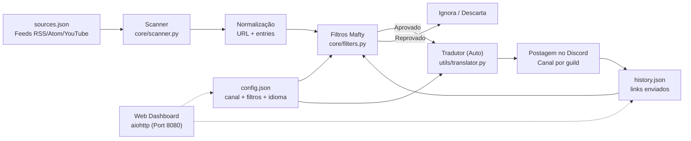
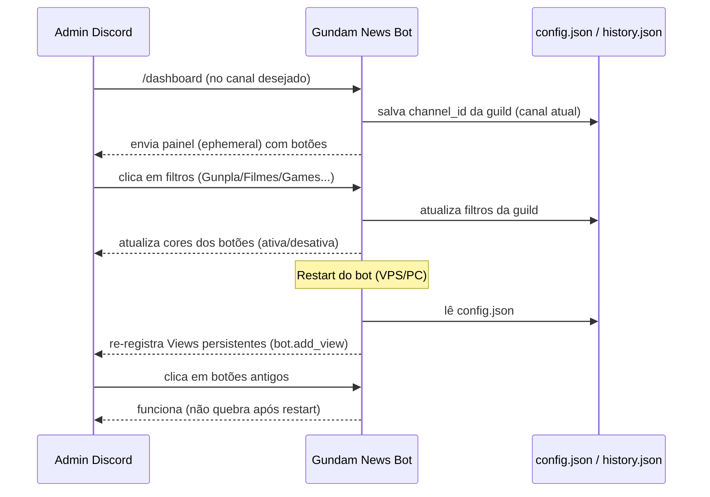
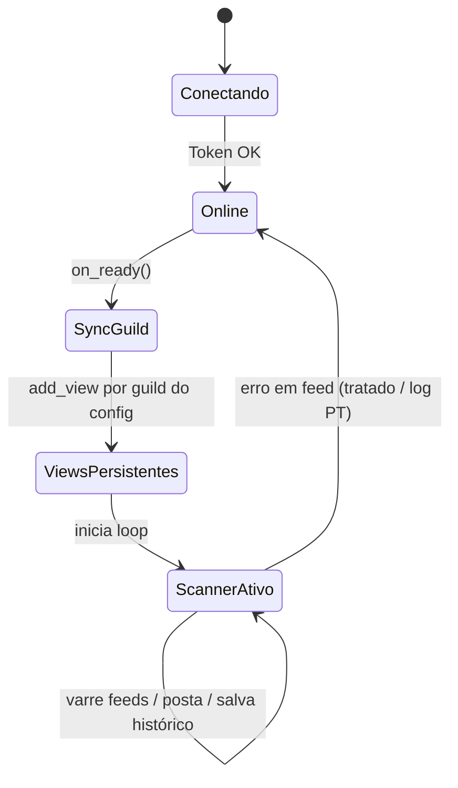
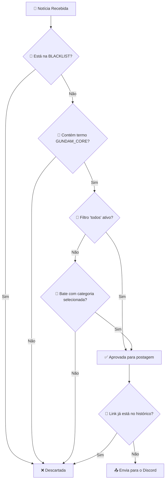

# 🛰️ Gundam News Bot — Mafty Intelligence System

<p align="center">
  
</p>

<p align="center">
  <a href="https://github.com/carmipa/gundam-news-discord/actions/workflows/python-app.yml">
    
  </a>
  
  
  
  
  
</p>

<p align="center">
  <b>Monitoramento inteligente de feeds RSS/Atom/YouTube sobre o universo Gundam</b><br>
  Filtragem cirúrgica • Dashboard interativo • Postagem automática no Discord
</p>

---

## 📋 Índice

- [✨ Funcionalidades](#-funcionalidades)
- [🧱 Arquitetura](#-arquitetura)
- [🚀 Instalação](#-instalação)
- [⚙️ Configuração](#️-configuração)
- [🧰 Comandos](#-comandos)
- [🎛️ Dashboard](#️-dashboard)
- [🧠 Sistema de Filtros](#-sistema-de-filtros)
- [🖥️ Deploy](#️-deploy)
- [🧩 Troubleshooting](#-troubleshooting)
- [📜 Licença](#-licença)

---

## ✨ Funcionalidades

| Feature | Descrição |
|---------|-----------|
| 📡 **Scanner Periódico** | Varredura de feeds RSS/Atom/YouTube a cada 30 minutos (configurável) |
| 🎛️ **Dashboard Persistente** | Painel interativo com botões que funciona mesmo após restart |
| 🎯 **Filtros por Categoria** | Gunpla, Filmes, Games, Música, Fashion + opção "TUDO" |
| 🛡️ **Anti-Spam** | Blacklist para bloquear animes/jogos não relacionados a Gundam |
| 🔄 **Deduplicação** | Nunca repete notícias (histórico em `history.json`) |
| 🌐 **Multi-Guild** | Configuração independente por servidor Discord |
| 📝 **Logs em PT-BR** | Mensagens claras para debug e monitoramento |
| 🎨 **Embeds Ricos** | Notícias com visual premium (cor Gundam, thumbnails, timestamps) |
| 🎞️ **Player Nativo** | Vídeos do YouTube/Twitch tocam direto no chat (sem abrir navegador) |
| 🌍 **Multi-Idioma** | Suporte a EN, PT, ES, IT (detecção automática + `/setlang`) |
| 🖥️ **Web Dashboard** | Painel visual em <http://host:8080> com status em tempo real |
| 🔐 **SSL Seguro** | Conexões verificadas com certifi (proteção contra MITM) |

---

## 🧱 Arquitetura

### 1) Visão Macro — Fluxo Completo de Dados



> **Legenda:**
>
> - `sources.json` — Lista de feeds monitorados
> - `config.json` — Configuração de canal e filtros por servidor
> - `history.json` — Links já enviados (deduplicação)

---

### 2) Fluxo do Comando `/dashboard` e Persistência de UI



> **Destaques:**
>
> - O painel é **ephemeral** (só você vê)
> - Botões funcionam **mesmo após restart** do bot
> - Configuração é **salva em disco** automaticamente

---

### 3) Estados Principais do Bot



> **Ciclo de vida:**
>
> 1. **Conectando** — Validando token
> 2. **Online** — Conectado ao Discord
> 3. **SyncGuild** — Sincronizando comandos slash
> 4. **ViewsPersistentes** — Restaurando botões do dashboard
> 5. **ScannerAtivo** — Loop de varredura rodando

---

## 🚀 Instalação

### Pré-requisitos

- Python 3.10 ou superior
- Token de bot do Discord ([Portal de Desenvolvedores](https://discord.com/developers/applications))

### Passo a passo

```bash
# 1. Clone o repositório
git clone https://github.com/carmipa/gundam-news-discord.git
cd gundam-news-discord

# 2. Crie ambiente virtual
python -m venv .venv

# Windows
.venv\Scripts\activate

# Linux/macOS
source .venv/bin/activate

# 3. Instale dependências
pip install -r requirements.txt

# 4. Configure o ambiente
cp .env.example .env
# Edite o .env com seu token
```

---

## ⚙️ Configuração

### Variáveis de Ambiente (`.env`)

```env
# Obrigatório
DISCORD_TOKEN=seu_token_aqui

# Opcional
COMMAND_PREFIX=!
LOOP_MINUTES=30
```

### Fontes de Feeds (`sources.json`)

O bot aceita dois formatos:

<details>
<summary><b>📁 Formato com categorias (recomendado)</b></summary>

```json
{
  "rss_feeds": [
    "https://www.animenewsnetwork.com/news/rss.xml",
    "https://gundamnews.org/feed"
  ],
  "youtube_feeds": [
    "https://www.youtube.com/feeds/videos.xml?channel_id=UCejtUitnpnf8Be-v5NuDSLw"
  ]
}
```

</details>

<details>
<summary><b>📁 Formato lista simples</b></summary>

```json
[
  "https://www.animenewsnetwork.com/news/rss.xml",
  "https://gundamnews.org/feed"
]
```

</details>

---

## 🧰 Comandos

| Comando | Tipo | Descrição |
|---------|------|-----------|
| `/dashboard` | Slash | Abre painel de configuração de filtros (Admin) |
| `/setlang` | Slash | Define o idioma do bot para o servidor (Admin) |
| `/forcecheck` | Slash | Força uma varredura imediata (Admin) |
| `/status` | Slash | Mostra estatísticas do bot (Uptime, Scans, etc) |
| `/feeds` | Slash | Lista todas as fontes monitoradas |
| `/help` | Slash | Mostra manual de ajuda |
| `/invite` | Slash | Link para convidar o bot |
| `!dashboard` | Prefixo | Legado: Mesma função do /dashboard |

> **🔒 Permissão:** Apenas administradores podem usar estes comandos.

---

## 🎛️ Dashboard

O painel interativo permite configurar quais categorias monitorar:

| Botão | Função |
|-------|--------|
| 🌟 **TUDO** | Liga/desliga todas as categorias |
| 🤖 **Gunpla** | Kits, P-Bandai, Ver.Ka, HG/MG/RG/PG |
| 🎬 **Filmes** | Anime, trailers, séries, Hathaway, SEED |
| 🎮 **Games** | Jogos Gundam (GBO2, Breaker, etc.) |
| 🎵 **Música** | OST, álbuns, openings/endings |
| 👕 **Fashion** | Roupas e merchandise |
| 📌 **Ver filtros** | Mostra filtros ativos |
| 🔄 **Reset** | Limpa todos os filtros |

### Indicadores visuais

- 🟢 **Verde** = Filtro ativo
- ⚪ **Cinza** = Filtro inativo

---

## 🧠 Sistema de Filtros

A filtragem **não é simples** — o bot usa um sistema em **camadas** para garantir precisão cirúrgica:

### Fluxo de Decisão



### ✅ Regras de Filtragem (ordem real)

| Etapa | Verificação | Ação |
|-------|-------------|------|
| 1️⃣ | Junta `title + summary` | Concatena texto |
| 2️⃣ | Limpa HTML e normaliza | Remove tags, espaços extras |
| 3️⃣ | **BLACKLIST** | Se aparecer (ex: *One Piece*), bloqueia |
| 4️⃣ | **GUNDAM_CORE** | Se não houver termos Gundam, bloqueia |
| 5️⃣ | Filtro `todos` ativo? | Libera tudo se sim |
| 6️⃣ | Categoria selecionada | Precisa bater com palavras-chave |
| 7️⃣ | **Deduplicação** | Se link já está em `history.json`, ignora |

### 🎯 Termos do GUNDAM_CORE

```
gundam, gunpla, mobile suit, universal century, rx-78, zaku, zeon, 
char, amuro, hathaway, mafty, seed, seed freedom, witch from mercury, 
g-witch, p-bandai, premium bandai, ver.ka, hg, mg, rg, pg, sd, fm, re/100
```

### 🚫 BLACKLIST (bloqueados)

```
one piece, dragon ball, naruto, bleach, pokemon, digimon, 
attack on titan, jujutsu, demon slayer
```

### 🔧 Onde ajustar precisão?

| Constante | Propósito |
|-----------|-----------|
| `GUNDAM_CORE` | Reforça o "é Gundam" — adicione termos aqui |
| `BLACKLIST` | Corta ruído de feeds generalistas |
| `CAT_MAP` | Ajusta gatilhos por categoria |

---

## 🖥️ Deploy

### Local (desenvolvimento)

```bash
python main.py
```

### VPS com systemd (produção)

Crie o arquivo `/etc/systemd/system/gundam-bot.service`:

```ini
[Unit]
Description=Gundam News Bot - Mafty Intel
After=network.target

[Service]
Type=simple
WorkingDirectory=/opt/gundam-bot
ExecStart=/opt/gundam-bot/.venv/bin/python main.py
Restart=always
RestartSec=5
User=gundam

[Install]
WantedBy=multi-user.target
```

Comandos úteis:

```bash
# Ativar e iniciar
sudo systemctl daemon-reload
sudo systemctl enable gundam-bot
sudo systemctl start gundam-bot

# Verificar status
sudo systemctl status gundam-bot

# Ver logs em tempo real
journalctl -u gundam-bot -f
```

### 🐳 VPS com Docker (recomendado para produção)

**Instalação rápida:**

```bash
# Clone o repositório
git clone https://github.com/carmipa/gundam-news-discord.git
cd gundam-news-discord

# Configure .env com seu token
cp .env.example .env
nano .env

# Inicie com Docker Compose
docker-compose up -d

# Ver logs
docker-compose logs -f
```

**Vantagens do Docker:**

- ✅ Reinício automático se crashar
- ✅ Isolamento completo do sistema
- ✅ Fácil atualização (`git pull && docker-compose restart`)
- ✅ Logs com rotação automática
- ✅ Portável entre servidores

📖 **Guia completo:** Veja [DEPLOY.md](DEPLOY.md) para instruções detalhadas.

---

## 🗂️ Estrutura do Projeto

```
gundam-news-discord/
├── 📄 main.py              # Bot principal
├── 📄 settings.py          # Carrega configurações do .env
├── 📄 sources.json         # Lista de feeds monitorados
├── 📄 requirements.txt     # Dependências Python
├── 📄 .env.example         # Exemplo de configuração
├── 📄 .gitignore           # Arquivos ignorados pelo Git
├── 🖼️ icon.png             # Ícone do bot
├── 📁 .github/             # Workflows do GitHub Actions
├── 📁 bot/                 # Lógica do bot (Cogs, Views)
├── 📁 core/                # Core do sistema (Scanner, Filtros)
├── 📁 tests/               # Testes automatizados
├── 📁 translations/        # Internacionalização (i18n)
├── 📁 utils/               # Utilitários (Logger, Helpers)
├── 📁 web/                 # Web Dashboard
└── 📄 README.md            # Esta documentação
```

> **Nota:** Os arquivos `config.json` e `history.json` são gerados automaticamente em runtime e estão no `.gitignore`.

---

## 🧩 Troubleshooting

<details>
<summary><b>❌ CommandNotFound: Application command 'dashboard' not found</b></summary>

**Causa:** Sincronização global lenta do Discord.

**Solução:** O bot já faz sync por guild no `on_ready()`. Aguarde alguns segundos após o bot conectar.

</details>

<details>
<summary><b>❌ AttributeError: 'str' object has no attribute 'get'</b></summary>

**Causa:** Formato incorreto do `sources.json`.

**Solução:** Verifique se o arquivo está em um dos formatos aceitos (lista ou dicionário com categorias).

</details>

<details>
<summary><b>⚠️ "PyNaCl is not installed… voice will NOT be supported"</b></summary>

**Isso não é erro!** É apenas um aviso. O bot não usa recursos de voz, pode ignorar com segurança.

</details>

---

## 🤝 Contribuindo

1. Faça um Fork do projeto
2. Crie sua feature branch (`git checkout -b feature/MinhaFeature`)
3. Commit suas mudanças (`git commit -m 'Adiciona MinhaFeature'`)
4. Push para a branch (`git push origin feature/MinhaFeature`)
5. Abra um Pull Request

---

## 📜 Licença

Este projeto está licenciado sob a **MIT License** - veja o arquivo [LICENSE](LICENSE) para detalhes.

---

## 👨‍💻 Autor

**Paulo André Carminati**  
[](https://github.com/carmipa)

---

<p align="center">
  🛰️ <i>Mafty Intelligence System — Vigilância contínua do Universal Century</i>
</p>
