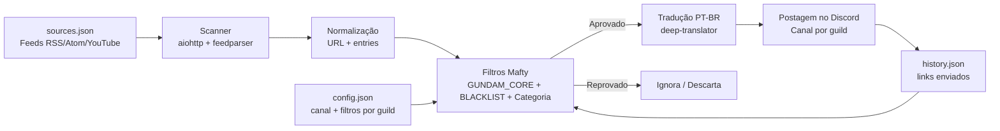
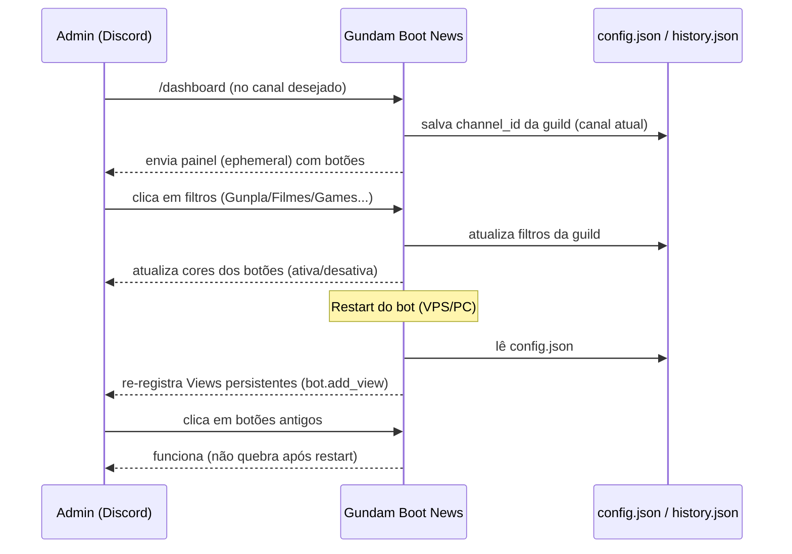
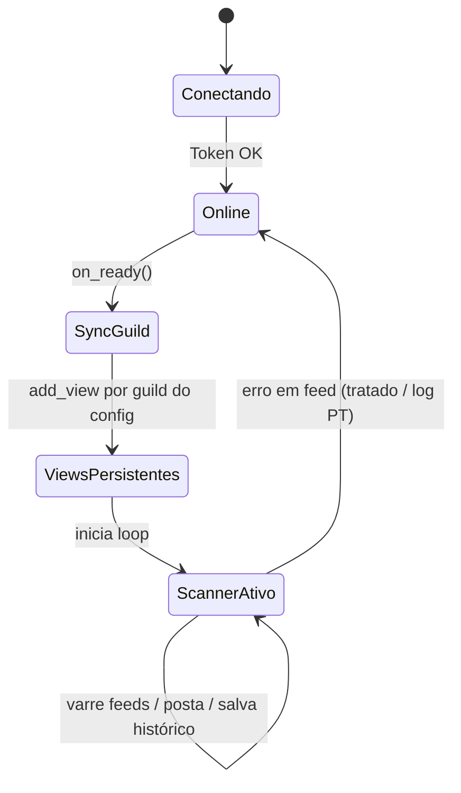

# 🛰️ Gundam Boot News — Mafty Intelligence System (Discord Bot)

<p align="center">
  
</p>


<p align="center">
  
  
  
  
  
</p>

> **Objetivo:** Monitorar feeds (RSS/Atom/YouTube Atom), filtrar **apenas** conteúdo do universo **Gundam**, traduzir para PT-BR e postar automaticamente no canal configurado — com **painel interativo persistente** e **filtros cirúrgicos**.

---

## ✅ O que este bot entrega (produção)

- ✅ **Scanner periódico** de feeds (RSS/Atom/YouTube Atom) via `aiohttp` + `feedparser`
- ✅ **Dashboard persistente** com botões (funciona mesmo após restart)
- ✅ **Filtros por categoria** + “TUDO” + “Reset” + “Ver filtros”
- ✅ **Anti-lixo**: exige termos do núcleo Gundam + **BLACKLIST** para bloquear animes/jogos não relacionados
- ✅ **Tradução PT-BR** (título e resumo) com fallback seguro (nunca quebra o bot)
- ✅ **Deduplicação rápida** (`set` em memória + `history.json` em disco)
- ✅ **Sincronização por guild** (propaga rápido e evita `CommandNotFound`)
- ✅ Logs e mensagens **100% em português**
- ✅ Código **100% comentado**
- ✅ Arquivo único principal: `main_mafty_producao.py`

---

## 🧱 Arquitetura

### 1) Visão macro



### 2) Fluxo do comando `/dashboard` e persistência de UI



### 3) Estados principais do bot



---

## 🗂️ Estrutura do repositório (GitHub)

Recomendação de estrutura para ficar “padrão GitHub” e organizado:

```text
.
├── main_mafty_producao.py        # ✅ Bot principal (produção)
├── settings.py                  # TOKEN, COMMAND_PREFIX, LOOP_MINUTES
├── sources.json                 # ✅ Feeds monitorados
├── config.json                  # (gerado) canal + filtros por guild
├── history.json                 # (gerado) links já enviados
├── requirements.txt             # dependências
├── docs/
│   ├── images/
│   │   ├── banner.png
│   │   └── mafty_dashboard.png
│   └── architecture.md          # opcional (docs extras)
└── README.md
```

> **Dica:** `config.json` e `history.json` geralmente entram no `.gitignore` (são runtime).

---

## ⚙️ Configuração (rápida e objetiva)

### 1) `settings.py`

Crie/edite o arquivo `settings.py` com:

```python
TOKEN = "SEU_TOKEN_DO_DISCORD"
COMMAND_PREFIX = "!"
LOOP_MINUTES = 15
```

### 2) `sources.json`

O bot aceita **dois formatos** (para evitar o erro antigo de “str não tem get”):

#### ✅ Formato recomendado (dict com categorias)

```json
{
  "rss_feeds": [
    "https://www.gundam.info/rss/news.xml"
  ],
  "youtube_feeds": [
    "https://www.youtube.com/feeds/videos.xml?channel_id=SEU_CHANNEL_ID"
  ],
  "official_sites": [
    "https://www.gundam.info/"
  ]
}
```

#### ✅ Formato simples (lista de URLs)

```json
[
  "https://www.gundam.info/rss/news.xml",
  "https://www.youtube.com/feeds/videos.xml?channel_id=SEU_CHANNEL_ID"
]
```

---

## 🧰 Comandos (Discord)

### `/dashboard` (Slash) — recomendado
- Mostra o painel em **ephemeral**
- Configura **o canal atual** como destino de postagem
- Permite selecionar categorias com botões

### `!dashboard` (Prefixo)
- Mesma função, mas responde como mensagem normal (Discord não suporta ephemeral em comando de prefixo)

> 🔒 Apenas administradores podem usar e alterar filtros.

---

## 🎛️ Dashboard (filtros e botões)

O painel tem:

| Botão             | O que faz                                   |
| ----------------- | ------------------------------------------- |
| 🌟 **TUDO**        | Liga/desliga todas as categorias de uma vez |
| 🤖 **Gunpla**      | Kits, P-Bandai, Ver.Ka, HG/MG/RG/PG...      |
| 🎬 **Filmes**      | Anime, trailer, séries, Hathaway, SEED...   |
| 🎮 **Games**       | Jogos e updates relacionados a Gundam       |
| 🎵 **Música**      | OST, álbum, opening/ending                  |
| 👕 **Fashion**     | Roupa, merch, apparel                       |
| 📌 **Ver filtros** | Mostra filtros ativos (ephemeral)           |
| 🔄 **Reset**       | Limpa todos os filtros                      |

### Como funciona a cor dos botões?
- **Verde (success)** = filtro ativo
- **Cinza (secondary)** = filtro inativo

---

## 🧠 Como a filtragem “cirúrgica” funciona (sem chute)

A decisão **não é “categoria = game então manda qualquer game”**.  
O bot faz **camadas** de validação:

### ✅ Regras (ordem real)
1) Junta texto: `title + summary`
2) Limpa HTML e normaliza
3) **BLACKLIST**: se aparecer algo (ex.: *One Piece*, *Pokémon*), bloqueia na hora
4) **GUNDAM_CORE**: se não houver termos centrais do universo Gundam, bloqueia
5) Se filtro `todos` estiver ativo: libera
6) Se não: precisa bater com **palavras-chave da(s) categoria(s)** selecionada(s)
7) Deduplicação: se o link já está em `history.json`, ignora

### Onde ajustar precisão?
- `GUNDAM_CORE` → reforça o “é Gundam”
- `BLACKLIST` → corta ruído de feeds generalistas
- `CAT_MAP` → ajusta gatilhos por categoria

---

## 🔁 Scanner (loop) — como ele evita travar e não “silencia”

O loop (`intelligence_gathering`) foi desenhado para VPS:

- Timeout total do request (`ClientTimeout(total=25)`)
- SSL tolerante (feeds antigos)
- `User-Agent` para reduzir bloqueios
- Try/except por feed e por envio
- Logs claros em PT-BR para `journalctl` e console
- `history.json` limitado (por padrão, 2000 links) para não crescer infinito

---

## 🖥️ Execução (PC / VPS)

### PC (Windows/macOS/Linux)
```bash
python main_mafty_producao.py
```

### VPS (systemd) — opcional (produção)
> Se você usa systemd, este é o padrão recomendado.

Crie `/etc/systemd/system/gundam-bot.service`:

```ini
[Unit]
Description=Gundam Intel Bot - Mafty Sovereign
After=network.target

[Service]
Type=simple
WorkingDirectory=/opt/gundam-bot
ExecStart=/opt/gundam-bot/venv/bin/python /opt/gundam-bot/main_mafty_producao.py
Restart=always
RestartSec=5
User=root

[Install]
WantedBy=multi-user.target
```

Comandos:
```bash
sudo systemctl daemon-reload
sudo systemctl enable gundam-bot
sudo systemctl restart gundam-bot
journalctl -u gundam-bot -f
```

---

## 📸 Screenshots

> Coloque suas imagens em `docs/images/` e ajuste os links abaixo.

<p align="center">
  
</p>

---

## 🧩 Troubleshooting (erros que já foram eliminados)

### ✅ `AttributeError: 'Context' object has no attribute 'followup'`
**Causa:** usar `ctx.followup` quando o comando roda como prefixo.  
**Correção aplicada:** o bot detecta `ctx.interaction` e usa `followup` apenas em slash.

### ✅ `CommandNotFound: Application command 'dashboard' not found`
**Causa:** sync global lento/instável.  
**Correção aplicada:** sync **por guild** no `on_ready()`.

### ✅ `AttributeError: 'str' object has no attribute 'get'`
**Causa:** `sources.json` em formato diferente do esperado.  
**Correção aplicada:** normalizador aceita **lista** e **dict**.

### ⚠️ “PyNaCl is not installed… voice will NOT be supported”
**Isso não é erro.** É aviso de voz — pode ignorar (bot não usa voz).

---

## 📜 Licença
MIT — use, modifique e distribua à vontade.

---

## 🧑‍💻 Autor
**Paulo André Carminati**  
Bot em produção (PCAR Squad)

---

🛰️ *Mafty Intelligence System — Vigilância contínua do Universal Century*
