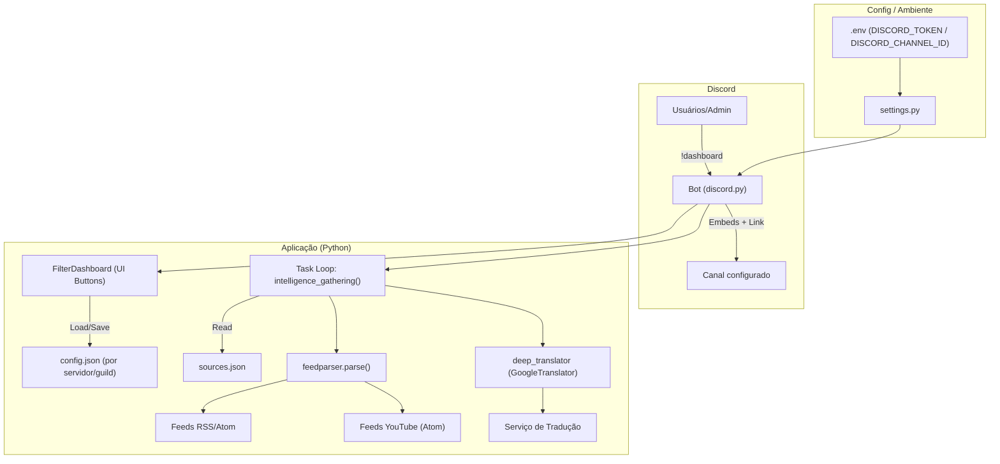

# 🛰️ Gundam Boot News — Mafty Intelligence System (v2.0)

<p align="center">
  
</p>

<p align="center">
  
</p>

<p align="center">
  
  
  
  
  
  
</p>

O **Mafty Intelligence System** é um bot de automação avançada para **Discord**, focado no ecossistema **Gundam** e **Gunpla**.  
Ele monitora feeds globais (**RSS/Atom** e **YouTube**) e entrega **inteligência traduzida e categorizada** diretamente no seu servidor.

> **Tema:** *Mafty Intelligence* — soberania informacional em tempo real.

---

## 🚀 Funcionalidades de Elite (Core Features)

- **Soberania SaaS (Multi-Servidor):** configurações independentes por servidor (guild), salvando preferências de canal e filtros por servidor.
- **Dashboard de Filtros (UI/UX):** use `!dashboard` para abrir um painel interativo com botões e escolher categorias.
- **Categorização Inteligente:**
  - 📦 **Gunpla** — HG / MG / RG / P-Bandai / Model Kits
  - 🎬 **Filmes/Anime** — releases, trailers, episódios, etc.
  - 🎮 **Games** — console/PC/mobile, updates e patches
  - 🎵 **Músicas** — OST, OP/ED, releases
  - 👕 **Fashion** — collabs e apparel
- **Tradução em Tempo Real:** EN/JP → PT-BR (título do alerta).
- **Combo Visual “Rich Preview”:** envia **Embed + link puro** para forçar preview grande no Discord.

---

## 🧱 Arquitetura (Diagrama)

> GitHub renderiza Mermaid nativamente. Se você estiver visualizando fora do GitHub, pode aparecer como código.



---

## 🧭 Fontes Monitoradas

> As fontes ficam em `sources.json`, assim você edita sem mexer no código.

- **rss_feeds**: RSS/Atom de sites (notícias, gunpla, lojas, etc.)
- **youtube_feeds**: Atom feed de canais do YouTube
- **official_sites**: lista de referência (links oficiais)

---

## 🧰 Requisitos

- **Python 3.10+**
- Dependências (via `requirements.txt`):
  - `discord.py`
  - `feedparser`
  - `python-dotenv`
  - `deep-translator`

---

## 🛠️ Instalação

### 1) Clonar o repositório
```bash
git clone https://github.com/carmipa/gundam-news-discord.git
cd gundam-news-discord
```

### 2) Criar e ativar ambiente virtual (recomendado)

**Windows (PowerShell)**
```bash
python -m venv .venv
.\.venv\Scripts\Activate.ps1
```

**Linux/macOS**
```bash
python3 -m venv .venv
source .venv/bin/activate
```

### 3) Instalar dependências
```bash
pip install -r requirements.txt
```

---

## 🔐 Configuração do `.env`

Crie um arquivo `.env` na raiz (você pode copiar de `.env.example`):

```env
DISCORD_TOKEN=seu_token_aqui
DISCORD_CHANNEL_ID=seu_id_do_canal_aqui
```

> **Segurança:** nunca faça commit do `.env`. Mantenha no `.gitignore`.

---

## 📡 Como Usar

### 1) Inicie o bot
```bash
python main.py
```

### 2) Configure filtros/canal
No Discord (com permissões de admin):
1. Vá no canal que você quer receber os alertas
2. Digite: `!dashboard`
3. Clique nos botões para ativar/desativar categorias (🌟 **Tudo / All-In** para cobertura total)

---

## 🗂️ Estrutura do Projeto

```txt
.
├─ main.py              # núcleo + comandos + UI (dashboard) + loop de monitoramento
├─ settings.py          # lê DISCORD_TOKEN / DISCORD_CHANNEL_ID do .env
├─ sources.json         # feeds RSS/Atom + YouTube Atom + sites oficiais
├─ config.json          # persistência por servidor (NÃO versionar em produção)
├─ icon.png             # ícone do projeto (usado neste README)
├─ .env.example         # modelo de .env (sem segredos)
├─ .gitignore
└─ README.md
```

---

## 🧪 Troubleshooting

### ❌ Erro 403 / 50013 — Missing Permissions
Se o log mostrar `50013`, o bot não tem permissão para postar no canal.

**Como resolver**
- Permissões do canal:
  - ✅ Ver Canal
  - ✅ Enviar Mensagens
  - ✅ Inserir Links
  - ✅ Incorporar Links (Embeds)

---

## 🛡️ Roadmap Anti-Flood (próximos upgrades)

- **Dedup global** por `guid → link → hash(title+source)`  
- **Cache por janela** (ex.: últimos 2000 hashes por 7–30 dias)
- **ETag/Last-Modified** para evitar reprocessar o feed inteiro
- **Rate-limit por fonte** (ex.: 3 posts/10 min por feed)
- **Modo Digest** (1 embed com 10 links por ciclo)

---

## ☄️ Nota

Desenvolvido para entusiastas de **Gundam** e **Gunpla**.  
**“Que a soberania de Mafty guie seus alertas!”**
