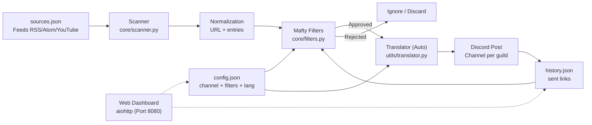
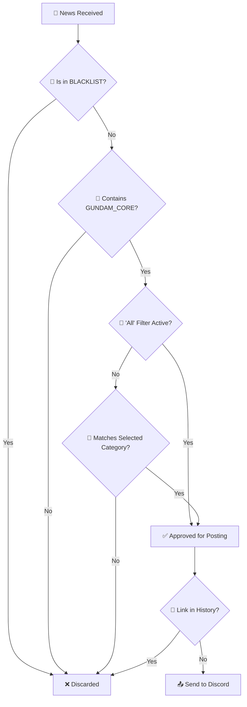

# 🛰️ Gundam News Bot — Mafty Intelligence System

<p align="center">
  
</p>

<p align="center">
  <a href="https://github.com/carmipa/gundam-news-discord/actions/workflows/python-app.yml">
    
  </a>
  
  
  
  
  
</p>

<p align="center">
  <b>Intelligent monitoring of RSS/Atom/YouTube feeds about the Gundam universe</b><br>
  Surgical filtering • Interactive Dashboard • Auto-posting to Discord
</p>

---

## 📋 Table of Contents

- [✨ Features](#-features)
- [🧱 Architecture](#-architecture)
- [🚀 Installation](#-installation)
- [⚙️ Configuration](#️-configuration)
- [🧰 Commands](#-commands)
- [🎛️ Dashboard](#️-dashboard)
- [🧠 Filter System](#-filter-system)
- [🖥️ Deploy](#️-deploy)
- [🧩 Troubleshooting](#-troubleshooting)
- [📜 License](#-license)

---

## ✨ Features

| Feature | Description |
|---------|-----------|
| 📡 **Periodic Scanner** | Scans RSS/Atom/YouTube feeds every 30 minutes (configurable) |
| 🎛️ **Persistent Dashboard** | Interactive panel with buttons that work even after restart |
| 🎯 **Category Filters** | Gunpla, Movies, Games, Music, Fashion + "ALL" option |
| 🛡️ **Anti-Spam** | Blacklist to block non-Gundam related anime/games |
| 🔄 **Deduplication** | Never repeats news (history in `history.json`) |
| 🌐 **Multi-Guild** | Independent configuration per Discord server |
| 🎨 **Rich Embeds** | Premium looking news (Gundam color, thumbnails, timestamps) |
| 🌍 **Multi-Language** | Support for EN, PT, ES, IT (auto-detect + `/setlang`) |
| 🖥️ **Web Dashboard** | Visual panel at <http://host:8080> with real-time status |
| 🔐 **Secure SSL** | Verified connections with certifi (MITM protection) |

---

## 🧱 Architecture

### 1) Macro View — Full Data Flow



---

## 🚀 Installation

### Prerequisites

- Python 3.10 or higher
- Discord Bot Token ([Developer Portal](https://discord.com/developers/applications))

### Step by Step

```bash
# 1. Clone the repository
git clone https://github.com/carmipa/gundam-news-discord.git
cd gundam-news-discord

# 2. Create virtual environment
python -m venv .venv

# Windows
.venv\Scripts\activate

# Linux/macOS
source .venv/bin/activate

# 3. Install dependencies
pip install -r requirements.txt

# 4. Configure environment
cp .env.example .env
# Edit .env with your token
```

---

## ⚙️ Configuration

### Environment Variables (`.env`)

```env
# Required
DISCORD_TOKEN=your_token_here

# Optional
COMMAND_PREFIX=!
LOOP_MINUTES=30
```

### Feed Sources (`sources.json`)

Two formats accepted:

<details>
<summary><b>📁 Category Format (Recommended)</b></summary>

```json
{
  "rss_feeds": [
    "https://www.animenewsnetwork.com/news/rss.xml",
    "https://gundamnews.org/feed"
  ],
  "youtube_feeds": [
    "https://www.youtube.com/feeds/videos.xml?channel_id=UCejtUitnpnf8Be-v5NuDSLw"
  ]
}
```

</details>

---

## 🧰 Commands

| Command | Type | Description |
|---------|------|-----------|
| `/dashboard` | Slash | Opens filter configuration panel (Admin) |
| `/setlang` | Slash | Sets bot language for the server (Admin) |
| `/forcecheck` | Slash | Forces immediate scan (Admin) |
| `/status` | Slash | Shows bot statistics (Uptime, Scans, etc) |
| `/feeds` | Slash | Lists all monitored sources |
| `/help` | Slash | Shows help manual |
| `/invite` | Slash | Link to invite the bot |
| `!dashboard` | Prefix | Legacy: Same function as /dashboard |

> **🔒 Permission:** Admin restricted commands are marked above.

---

## 🎛️ Dashboard

The interactive panel allows configuring which categories to monitor:

| Button | Function |
|-------|--------|
| 🌟 **ALL** | Toggle all categories |
| 🤖 **Gunpla** | Kits, P-Bandai, Ver.Ka, HG/MG/RG/PG |
| 🎬 **Movies** | Anime, trailers, series, Hathaway, SEED |
| 🎮 **Games** | Gundam Games (GBO2, Breaker, etc.) |
| 🎵 **Music** | OST, albums, openings/endings |
| 👕 **Fashion** | Apparel and merchandise |
| 📌 **View Filters** | Shows active filters |
| 🔄 **Reset** | Clears all filters |

---

## 🧠 Filter System

The bot uses a **layered** system to ensure surgical precision:

### Decision Flow



---

## 🖥️ Deploy

### Local (Development)

```bash
python main.py
```

### 🐳 VPS with Docker (Production)

**Quick Install:**

```bash
# Clone
git clone https://github.com/carmipa/gundam-news-discord.git
cd gundam-news-discord

# Config
cp .env.example .env
# Edit .env

# Start
docker-compose up -d --build
```

**Benefits:**

- ✅ Auto-restart
- ✅ Complete isolation
- ✅ Easy update
- ✅ Log rotation

---

## 🧩 Troubleshooting

<details>
<summary><b>❌ CommandNotFound: Application command 'dashboard' not found</b></summary>

**Cause:** Discord global sync lag.
**Solution:** Use the command `!sync` (prefix) to force immediate registration.
</details>

<details>
<summary><b>❌ AttributeError: '_EnumValue_Locale' object...</b></summary>

**Cause:** Old code in `translator.py`.
**Solution:** Update to v2.1 (already fixed in `main` branch).
</details>

---

## 📜 License

This project is licensed under the **MIT License** - see [LICENSE](LICENSE) file for details.

---

<p align="center">
  🛰️ <i>Mafty Intelligence System — Vigilance for the Universal Century</i>
</p>
