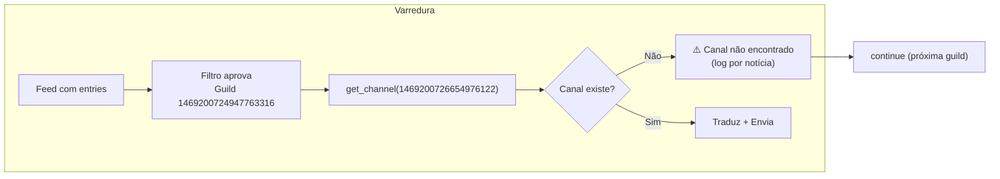

# 🔍 Análise aprofundada dos logs (Docker / runtime)

Este documento analisa um trecho real de logs do bot em execução (Docker), com foco em **startup**, **feeds**, **HTML Monitor**, **canal inválido** e **clean_state / cold start**.

---

## 📋 Resumo executivo

| Ponto | Situação | Ação recomendada |
|-------|----------|------------------|
| **Guilds vs Views** | 6 servidores conectados, 12 views registradas | Normal se `config.json` tiver guilds de servidores que o bot saiu; opcional: limpar config. |
| **Versão (None)** | `get_current_hash()` retorna `None` | Esperado em Docker sem Git; anúncio de versão é ignorado. |
| **Feeds 200 OK / 0 entradas** | Alguns feeds respondem mas vazios | Pode ser temporário, formato diferente ou auth; monitorar. |
| **Canal não encontrado** | Guild `1469200724947763316` com canal `1469200726654976122` inválido | **Corrigir:** usar `/set_canal` nessa guild ou remover canal do config. |
| **HTML Monitor** | weibo erro de conexão; muitos "CHANGE DETECTED" → depois "Initialized hash" | Normal após `clean_state tipo=tudo` (hashes zerados). |
| **clean_state** | Executado com sucesso (backup + auditoria) | Comportamento correto. |
| **Cold Start** | Muitos feeds em cold start após limpeza total | Esperado (dedup vazio). |

---

## 1️⃣ Startup e contagem de guilds

### O que aparece nos logs

```
📊 Servidores conectados: 6
View persistente registrada para guild 417746665219424277
... (mais 11 guilds)
Comandos sincronizados (copy_global) em: PCAR-CARMINATI
... (6 servidores)
```

### Análise

- **Servidores conectados: 6** — Número de guilds em que o bot **está** (API Discord).
- **View persistente registrada para guild X** — Uma view é registrada para **cada guild presente em `config.json`**, não só nas 6 atuais.
- **Comandos sincronizados em: Nome** — Sync de slash é feito **só** para as 6 guilds atuais (`bot.guilds`).

Conclusão: o `config.json` tem **12 guilds** (incluindo as 6 atuais). As outras 6 podem ser de servidores dos quais o bot saiu ou que ainda estão no config por histórico. Isso não quebra nada; as views extras não são usadas até alguém interagir. Opcional: limpar do config guilds que não estão mais em `bot.guilds`.

---

## 2️⃣ Versão atual (None)

### Log

```
ℹ️ Versão atual (None) já anunciada anteriormente.
```

### Análise

- Em `main.py`, o anúncio de nova versão usa `get_current_hash()` (em `utils/git_info.py`).
- O hash vem de `git log -1 --pretty=format:'%h'`.
- Em ambiente **Docker** típico, a imagem pode:
  - Não ter `git` instalado, ou
  - Não ser um clone (só cópia dos arquivos).

Nesses casos `get_current_hash()` retorna `None`. O código trata: se `current_hash` é `None` ou igual a `last_announced_hash`, não anuncia. Por isso a mensagem "Versão atual (None) já anunciada anteriormente" — na prática **não há anúncio de versão** nesse ambiente.

Recomendações:

- Se quiser anúncio de versão no Docker: instalar `git` na imagem e garantir que o build use um clone (ou injetar o hash via env).
- Se não precisar: deixar como está; o bot funciona normalmente.

---

## 3️⃣ Feeds com HTTP 200 mas 0 entradas

### Logs

```
⚠️ Feed retornou 200 OK mas 0 entradas: https://gundamnews.org/feed
⚠️ Feed retornou 200 OK mas 0 entradas: https://www.crunchyroll.com/news/rss?lang=en-us
⚠️ Feed retornou 200 OK mas 0 entradas: https://www.gundamkitscollection.com/feeds/posts/default/-/The%20Gundam%20Base
... (outros)
```

### Análise

- O servidor responde **200 OK**, mas o corpo (RSS/Atom) não tem `entries` (ou o parser não encontrou).
- Possíveis causas:
  - Feed temporariamente vazio.
  - Formato diferente (ex.: só um nó raiz sem itens).
  - Página de login/redirect em vez do XML (ex.: Crunchyroll).
  - Rate limit ou bloqueio por User-Agent/IP.

O bot não quebra; apenas não há itens para esse feed naquela varredura. Recomendação: manter os logs em WARNING e, se algum feed for crítico e sempre vazio, verificar manualmente a URL e o formato.

---

## 4️⃣ Canal não encontrado (problema recorrente)

### Logs (repetidos muitas vezes)

```
✨ [Match] Guild 1469200724947763316 aprovou: What to See and Do at Gundam Base Korea...
⚠️ Canal 1469200726654976122 não encontrado.
```

O mesmo padrão para **dezenas** de notícias: a guild **1469200724947763316** tem em `config.json` o `channel_id` **1469200726654976122**, mas `bot.get_channel(channel_id)` retorna `None`.

### Análise

- O canal foi **deletado**, ou o bot **não está mais no servidor**, ou **não tem mais acesso** ao canal.
- O fluxo atual:
  1. Filtros aprovam a notícia para essa guild.
  2. Bot gera embed e prepara envio.
  3. Só então chama `get_channel(channel_id)` e falha.
  4. Log "Canal X não encontrado" e `continue`.

Consequências:

- **Log muito repetido** (uma linha por notícia aprovada para essa guild).
- **Desperdício de trabalho** (tradução, processamento) para um canal que não existe.
- **Experiência do admin**: notícias “aprovadas” mas que nunca aparecem.

### O que são esses números? (Guild ID e Channel ID)

No Discord, **tudo tem um ID numérico**:

| ID nos logs | Significado |
|-------------|-------------|
| **Guild ID** (ex.: `1469200724947763316`) | ID do **servidor** Discord. Cada servidor tem um número único. |
| **Channel ID** (ex.: `1469200726654976122`) | ID do **canal de texto** configurado para receber notícias. |

**Como descobrir qual é o servidor e o canal:**

1. **Pelo nome no log (após a melhoria):** o bot agora mostra o **nome do servidor** quando consegue resolvê-lo, por exemplo:  
   `Canal 1469200726654976122 não encontrado — Guild 1469200724947763316 (servidor: Nome do Servidor)`  
   Assim você sabe em qual servidor entrar e usar `/set_canal`.

2. **Pelo Discord (modo desenvolvedor):**  
   - Ative **Configurações → Avançado → Modo desenvolvedor**.  
   - Clique com o botão direito no **servidor** (ícone) → **Copiar ID do servidor** → confira se é o Guild ID.  
   - Clique com o botão direito no **canal** → **Copiar ID do canal** → confira se é o Channel ID.

3. **Pelo config.json:** abra `config.json`; as chaves são Guild IDs e, dentro de cada uma, `channel_id` é o Channel ID. Não há nome do servidor/canal no arquivo, só os números.

Se o **canal foi deletado** ou o **bot saiu do servidor**, esse canal_id fica “órfão” no config e o bot não consegue mais enviar para ele — daí o aviso. A solução é entrar no servidor correto e usar `/set_canal` (ou `/dashboard`) para escolher um canal que exista.

---

### Recomendações implementáveis

1. **Validação no startup**  
   Após carregar `config.json`, para cada guild com `channel_id`, chamar `bot.get_channel(channel_id)`. Se for `None`, logar **uma vez** em WARNING com guild id e channel id, sugerindo usar `/set_canal` ou `/dashboard` nessa guild.

2. **Validação antes do loop de envio**  
   Antes de traduzir e montar o embed para uma guild, verificar se `bot.get_channel(channel_id)` existe. Se não existir, pular a guild (e opcionalmente logar uma vez por varredura para essa guild).

3. **Limitar log repetido**  
   Em vez de logar "Canal X não encontrado" a cada notícia, usar um set por varredura (ex.: `invalid_channels_this_scan`) e logar **uma vez** por (guild_id, channel_id) por varredura.

4. **Ação manual imediata**  
   No servidor cuja guild é **1469200724947763316**: usar `/set_canal` (ou `/dashboard`) e escolher um canal válido. Se o bot não estiver mais nesse servidor, pode-se remover essa guild do `config.json` para parar tentativas e logs.

---

## 5️⃣ HTML Monitor: weibo e “CHANGE DETECTED” vs “Initialized hash”

### Erro de conexão

```
⚠️ 🌐 Erro de conexão no HTML Monitor para 'https://weibo.com/n/BandaiNamcoChina':
```

- Weibo pode bloquear bots, exigir cookies ou estar inacessível de fora da China. O bot trata o erro e segue; não é crítico.

### Muitos “CHANGE DETECTED” e depois “Initialized hash”

- **Primeira varredura (após boot):**  
  Como os hashes em `state.json` ainda existiam, vários sites apareceram como **CHANGE DETECTED** (hash atual diferente do salvo).

- **Após `/clean_state tipo=tudo`:**  
  O `state.json` teve **html_hashes** zerados. Na **próxima** varredura, não havia hash anterior, então o bot gravou o hash atual e logou **Initialized hash** para cada URL. Isso é **esperado** após limpar “tudo”.

Não indica bug; indica que o HTML Monitor está reinicializando o estado após a limpeza.

---

## 6️⃣ clean_state e Cold Start

### clean_state

Logs mostram:

- Comando registrado com data/hora e usuário.
- Início da limpeza (tipo=tudo).
- Backup criado.
- Limpeza concluída (antes: 134 links, 44 URLs, 71 sites → depois: 0/0/0).
- state.json salvo.
- AUDIT com user, guild, tipo, backup e antes/depois.

Comportamento **correto** e alinhado ao desenho (backup, confirmação, auditoria).

### Cold Start

Após `clean_state tipo=tudo`, o **dedup** fica vazio. Na próxima varredura (incluindo `/forcecheck`):

- Cada feed é tratado como “novo” (sem histórico).
- O cold start permite postar as **3 primeiras** notícias de cada feed sem respeitar a regra de 7 dias.

Por isso há muitas linhas:

```
❄️ [Cold Start] Detectado para https://... Ignorando travas de tempo para os 3 primeiros posts.
```

É o comportamento **esperado** após limpeza total e evita “silêncio” prolongado em todos os feeds.

---

## 7️⃣ Diagrama do fluxo (canal inválido)



Para reduzir ruído e trabalho inútil, a validação de canal pode ser feita **antes** do bloco de tradução/embed (e o log de “canal não encontrado” limitado a uma vez por guild por varredura).

---

## 8️⃣ Checklist de ações

| # | Ação | Prioridade |
|---|------|------------|
| 1 | No servidor da guild **1469200724947763316**: usar `/set_canal` ou `/dashboard` e definir um canal válido (ou remover a guild do config se o bot não estiver mais lá). | Alta |
| 2 | Implementar validação de canal no startup e/ou antes de processar envio por guild, com log único por (guild, channel) por varredura. | Média |
| 3 | (Opcional) No Docker, instalar `git` e usar clone se quiser anúncio de nova versão; senão, aceitar "Versão atual (None)". | Baixa |
| 4 | (Opcional) Revisar feeds que sempre retornam 200 OK com 0 entradas (ex.: gundamnews.org, crunchyroll) e ajustar fontes ou aceitar como temporários. | Baixa |

---

**Documento gerado a partir de análise de logs reais.**

### Identificação de fontes (sources.json) nos logs

Tudo que vem de **feeds** ou **páginas** listadas no `sources.json` passa a ser identificável nos logs pelo **endereço da página/feed**:

| Log | O que aparece |
|-----|----------------|
| **✨ [Match]** | `... \| fonte: https://...` (URL do feed em sources.json de onde veio a notícia) |
| **🛡️ [Filtro]** | `... \| fonte: https://...` (URL do feed cuja notícia foi bloqueada) |
| **🛡️ [Filtro HTML]** | `... \| página: https://...` (URL do site oficial cuja atualização foi bloqueada) |
| **HTML Monitor: Initialized hash / CHANGE DETECTED** | Já incluem a URL do site (`{url}`). |
| **Feed 200 OK mas 0 entradas / Erro de conexão / Timeout** | Já incluem a URL do feed. |

Assim você consegue saber **qual entrada do sources.json** (qual feed ou qual página) gerou cada mensagem de log. Os **canais** (Guild/Channel ID) são do **config.json** (Discord), não do sources.json.

---

### Melhorias implementadas após esta análise

- **Scanner:** validação de canal **antes** de processar/traduzir; log "Canal X não encontrado" **uma vez por (guild, channel) por varredura**, com sugestão de usar `/set_canal` ou `/dashboard`.
- **Startup (main.py):** ao conectar, o bot verifica cada `channel_id` do `config.json`; se o canal não existir, loga um aviso por canal inválido.

Para mais detalhes sobre o comando de limpeza, ver [docs/TUTORIAL_CLEAN_STATE.md](../docs/TUTORIAL_CLEAN_STATE.md).
