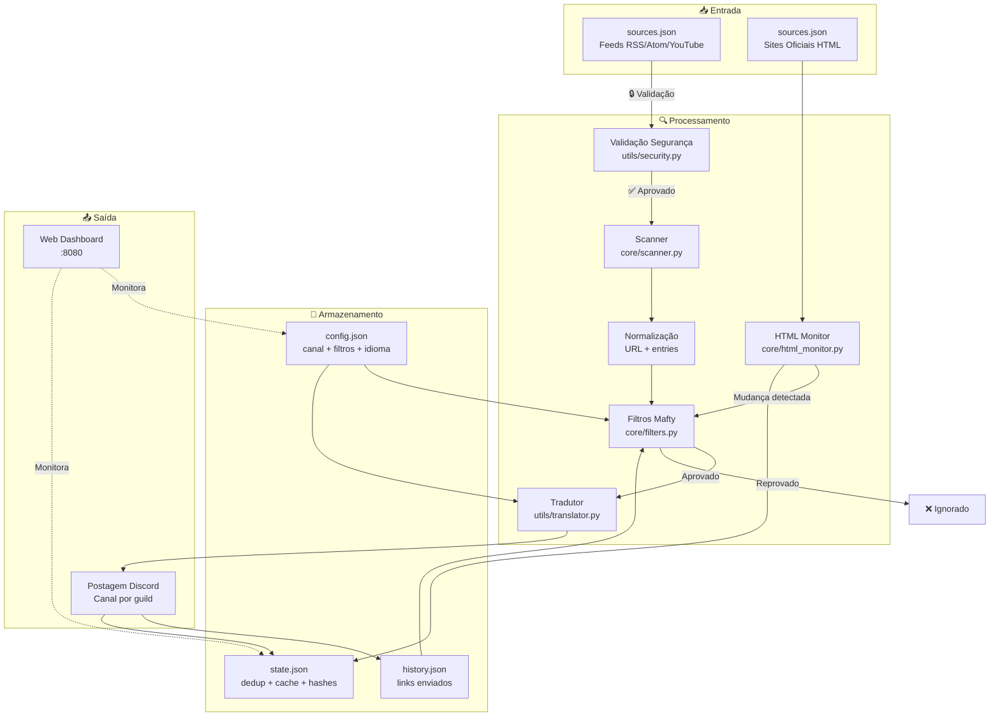
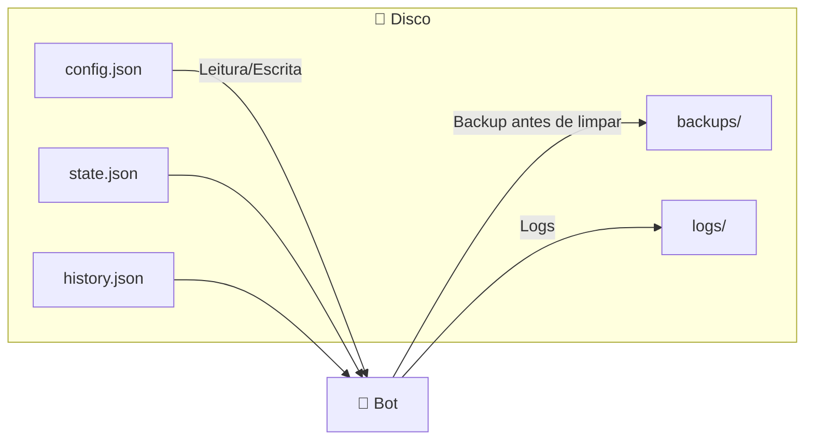
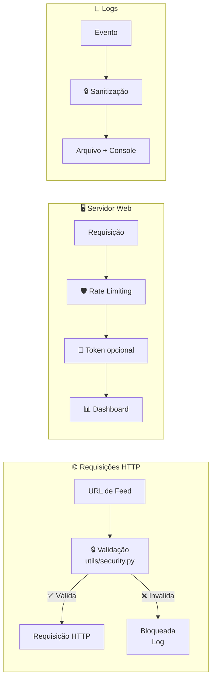
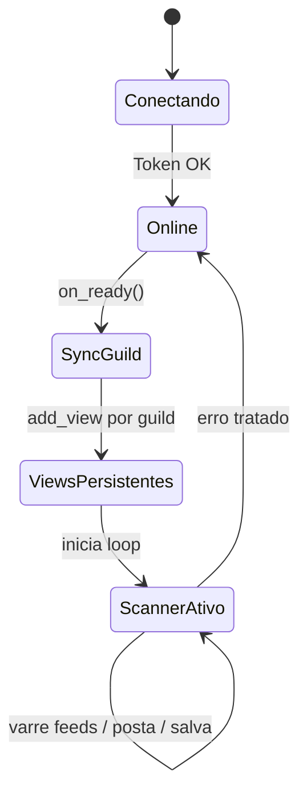
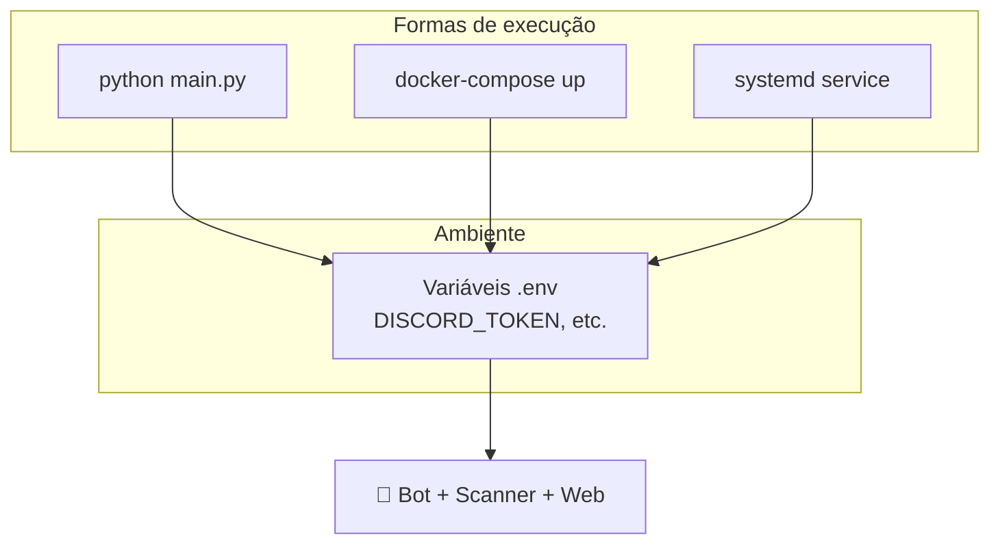

# 🧱 Arquitetura — Gundam News Bot

Visão geral da arquitetura do **Mafty Intelligence System**: fluxo de dados, componentes e segurança. Adaptado para leitura no GitHub (Mermaid + ícones).

---

## 📋 Índice

- [Visão macro](#-visão-macro---fluxo-completo-de-dados)
- [Arquivos de estado](#-arquivos-de-estado)
- [Componentes principais](#-componentes-principais)
- [Fluxo de segurança](#-fluxo-de-segurança)
- [Ciclo de vida do bot](#-ciclo-de-vida-do-bot)
- [Deploy e execução](#-deploy-e-execução)

---

## 📐 Visão macro — Fluxo completo de dados

| Símbolo | Significado |
|--------|-------------|
| 📥 | Entrada (feeds e sites) |
| 🔍 | Processamento (scanner, filtros, tradutor) |
| 💾 | Armazenamento (JSON em disco) |
| 📤 | Saída (Discord + Web) |
| 🔒 | Validação de segurança (anti-SSRF) |

---

## 📁 Arquivos de estado

| Arquivo | Função |
|---------|--------|
| `config.json` | Canal por guild, filtros (Gunpla, Filmes, etc.) e idioma. |
| `sources.json` | Lista de feeds (RSS/Atom/YouTube) e sites oficiais para o HTML Watcher. |
| `state.json` | Dedup por feed, cache HTTP (ETags), hashes HTML, metadados de limpeza. |
| `history.json` | Lista global de links já enviados (fallback de deduplicação). |
| `backups/` | Backups de `state.json` gerados pelo `/clean_state`. |
| `logs/bot.log` | Log rotativo da aplicação. |

---

## 🧩 Componentes principais

| Componente | Caminho | Responsabilidade |
|------------|---------|------------------|
| **Main** | `main.py` | Inicialização do bot, eventos, sync de comandos, carregamento de cogs. |
| **Scanner** | `core/scanner.py` | Loop de varredura de feeds, dedup, cache HTTP, postagem no Discord. |
| **HTML Monitor** | `core/html_monitor.py` | Monitoramento de sites oficiais (hash de conteúdo). |
| **Filtros** | `core/filters.py` | Regras de filtragem (GUNDAM_CORE, blacklist, categorias). |
| **Admin Cog** | `bot/cogs/admin.py` | Comandos `/forcecheck` e `/clean_state`. |
| **Dashboard Cog** | `bot/cogs/dashboard.py` | Comandos `/dashboard` e `/set_canal`. |
| **Info Cog** | `bot/cogs/info.py` | Comandos `/help`, `/about`, `/ping`, `/feeds`, `/setlang`. |
| **Status Cog** | `bot/cogs/status.py` | Comandos `/status` e `/now`. |
| **Storage** | `utils/storage.py` | Leitura/gravação JSON, backup, `clean_state` em memória. |
| **Security** | `utils/security.py` | Validação de URLs (anti-SSRF), sanitização de logs. |
| **Web** | `web/server.py` | Dashboard web (aiohttp), autenticação e rate limiting. |

---

## 🔒 Fluxo de segurança

- **URLs:** validadas antes de qualquer requisição (anti-SSRF).
- **Web:** rate limiting por IP e token opcional.
- **Logs:** sanitização de dados sensíveis antes de gravar/exibir.

---

## 🔄 Ciclo de vida do bot

1. **Conectando** — Validação do token.
2. **Online** — Conectado ao Discord.
3. **SyncGuild** — Sincronização dos comandos slash.
4. **ViewsPersistentes** — Restauração dos botões do dashboard.
5. **ScannerAtivo** — Loop de varredura em execução.

---

## 🐳 Deploy e execução

- **Local:** `python main.py` (desenvolvimento).
- **Produção:** Docker (recomendado) ou systemd; variáveis em `.env`.

Para detalhes de instalação e configuração, veja o [readme principal](../readme.md).
