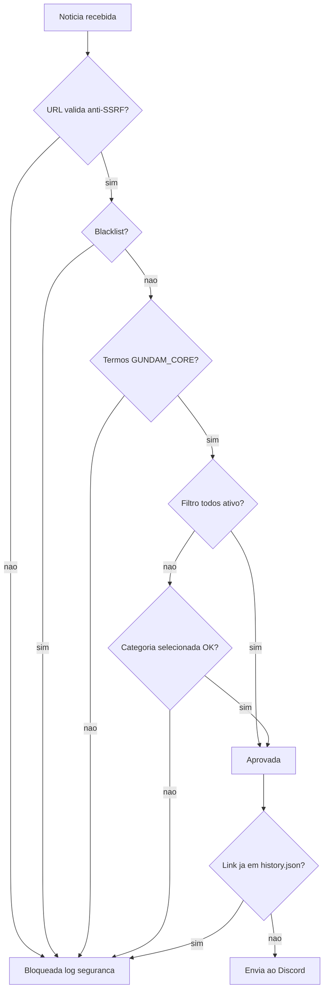

# Dashboard e sistema de filtros

[Voltar ao índice da documentação](https://github.com/carmipa/gundam-news-discord/blob/main/docs/README.md)

---

## Dashboard

O painel interativo permite configurar quais categorias monitorar:

| Botao | Funcao |
|-------|--------|
| **TUDO** | Liga/desliga todas as categorias |
| **Gunpla** | Kits, P-Bandai, Ver.Ka, HG/MG/RG/PG |
| **Filmes** | Anime, trailers, series, Hathaway, SEED |
| **Games** | Jogos Gundam (GBO2, Breaker, etc.) |
| **Musica** | OST, albuns, openings/endings |
| **Fashion** | Roupas e merchandise |
| **Idioma** | Seleciona idioma (EN, PT, ES, IT, JA) |
| **Ver filtros** | Mostra filtros ativos |
| **Reset** | Limpa todos os filtros |

### Indicadores visuais

- **Verde** = Filtro ativo
- **Cinza** = Filtro inativo
- **Azul** = Idioma selecionado

---

## Sistema de filtros

A filtragem usa um sistema em **camadas**.

### Fluxo de decisao



### Regras de filtragem (ordem real)

| Etapa | Verificacao | Acao |
|-------|-------------|------|
| 0 | **Validacao de Seguranca** | Verifica URL (anti-SSRF) |
| 1 | Junta `title + summary` | Concatena texto |
| 2 | Limpa HTML e normaliza | Remove tags, espacos extras |
| 3 | **BLACKLIST** | Se aparecer (ex: One Piece), bloqueia |
| 4 | **GUNDAM_CORE** | Se nao houver termos Gundam, bloqueia |
| 5 | Filtro `todos` ativo? | Libera tudo se sim |
| 6 | Categoria selecionada | Precisa bater com palavras-chave |
| 7 | **Deduplicacao** | Se link ja esta em `history.json`, ignora |

### Termos do GUNDAM_CORE

```
gundam, gunpla, mobile suit, universal century, rx-78, zaku, zeon, 
char, amuro, hathaway, mafty, seed, seed freedom, witch from mercury, 
g-witch, p-bandai, premium bandai, ver.ka, hg, mg, rg, pg, sd, fm, re/100
```

### BLACKLIST (bloqueados)

```
one piece, dragon ball, naruto, bleach, pokemon, digimon, 
attack on titan, jujutsu, demon slayer
```

---

**Relacionado:** [Arquitetura](https://github.com/carmipa/gundam-news-discord/blob/main/docs/ARCHITECTURE.md) · [Comandos](https://github.com/carmipa/gundam-news-discord/blob/main/docs/COMMANDS_REFERENCE.md)
