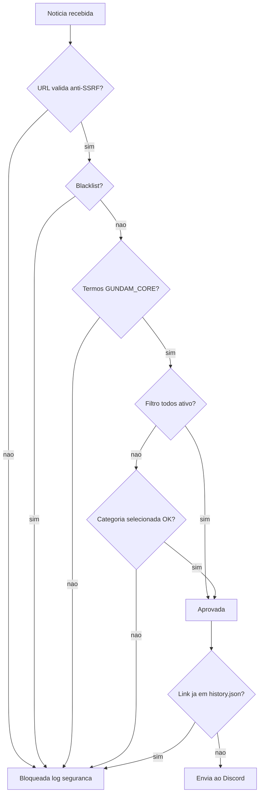

# 🎛️ Dashboard e sistema de filtros

← [Voltar ao índice da documentação](README.md)

---

## Dashboard

O painel interativo permite configurar quais categorias monitorar:

| Botão | Função |
|-------|--------|
| 🌟 **TUDO** | Liga/desliga todas as categorias |
| 🤖 **Gunpla** | Kits, P-Bandai, Ver.Ka, HG/MG/RG/PG |
| 🎬 **Filmes** | Anime, trailers, séries, Hathaway, SEED |
| 🎮 **Games** | Jogos Gundam (GBO2, Breaker, etc.) |
| 🎵 **Música** | OST, álbuns, openings/endings |
| 👕 **Fashion** | Roupas e merchandise |
| 🌐 **Idioma** | Seleciona idioma (🇺🇸 🇧🇷 🇪🇸 🇮🇹 🇯🇵) |
| 📌 **Ver filtros** | Mostra filtros ativos |
| 🔄 **Reset** | Limpa todos os filtros |

### Indicadores visuais

- 🟢 **Verde** = Filtro ativo
- ⚪ **Cinza** = Filtro inativo
- 🔵 **Azul** = Idioma selecionado

---

## Sistema de filtros

A filtragem **não é simples** — o bot usa um sistema em **camadas** para garantir precisão cirúrgica.

### Fluxo de decisão



### Regras de filtragem (ordem real)

| Etapa | Verificação | Ação |
|-------|-------------|------|
| 0️⃣ | **Validação de Segurança** | Verifica URL (anti-SSRF) |
| 1️⃣ | Junta `title + summary` | Concatena texto |
| 2️⃣ | Limpa HTML e normaliza | Remove tags, espaços extras |
| 3️⃣ | **BLACKLIST** | Se aparecer (ex: *One Piece*), bloqueia |
| 4️⃣ | **GUNDAM_CORE** | Se não houver termos Gundam, bloqueia |
| 5️⃣ | Filtro `todos` ativo? | Libera tudo se sim |
| 6️⃣ | Categoria selecionada | Precisa bater com palavras-chave |
| 7️⃣ | **Deduplicação** | Se link já está em `history.json`, ignora |

### Termos do GUNDAM_CORE

```
gundam, gunpla, mobile suit, universal century, rx-78, zaku, zeon, 
char, amuro, hathaway, mafty, seed, seed freedom, witch from mercury, 
g-witch, p-bandai, premium bandai, ver.ka, hg, mg, rg, pg, sd, fm, re/100
```

### BLACKLIST (bloqueados)

```
one piece, dragon ball, naruto, bleach, pokemon, digimon, 
attack on titan, jujutsu, demon slayer
```

---

**Relacionado:** [Arquitetura](ARCHITECTURE.md) · [Comandos](COMMANDS_REFERENCE.md)
