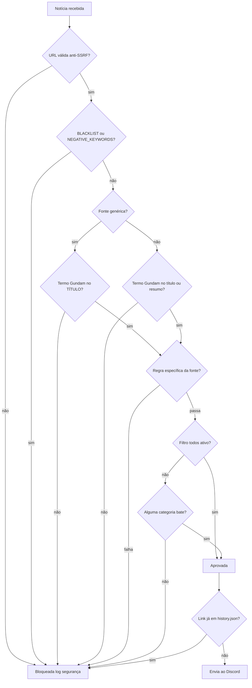

# Dashboard e sistema de filtros

[Voltar ao índice da documentação](https://github.com/carmipa/gundam-news-discord/blob/main/docs/README.md)

---

## Dashboard

`/dashboard` abre o painel interativo. Cada botão liga/desliga uma categoria.

| Botão | Chave em `config.json` | O que apanha |
|-------|------------------------|--------------|
| 🤖 **TUDO** | `todos` | Tudo o que passar no portão Gundam — ignora as categorias |
| 🛠️ **Model Kits & Gunpla** | `model_kits` | Kits, HG/MG/RG/PG/EG, Ver.Ka, plamo, option parts |
| 🎬 **Anime & Filmes** | `anime_movies` | Anime, filmes, séries, episódios, trailers, streaming, Blu-ray |
| 🎮 **Games** | `games` | GBO2, Breaker, UC Engage, patch notes, DLC, plataformas |
| 📍 **Eventos & Estátuas** | `eventos` | Gundam Base, estátuas, exposições, Hobby Show, Tamashii Features |
| 🧸 **Merch & Figuras** | `merchandise` | Figuras, Robot Spirits, Metal Build, S.H.Figuarts, goods |
| 🎵 **Músicas & Trilhas** | `musica` | OST, trilhas, temas de abertura/encerramento, singles, shows |
| 👕 **Roupas & Vestuário** | `roupas` | Strict-G, camisetas, moletons, jaquetas, bonés, colabs de moda |
| 💻 **Hardware & PC** | `hardware` | Edições Gundam de placas-mãe, GPUs, SSDs, gabinetes, periféricos |

Mais os controlos: **Idioma** (EN, PT, ES, IT, JA), **Ver filtros** e **Reset**.

### Indicadores visuais

- **Verde** = filtro ativo
- **Cinza** = filtro inativo
- **Azul** = idioma selecionado

### Categorias que se sobrepõem de propósito

`merchandise` é o guarda-chuva: também apanha roupas e hardware. As keywords
musicais vivem em `musica` **e** em `anime_movies`. Isto é intencional — quem já
assinava a categoria mais ampla não perde cobertura quando uma categoria mais
estreita é criada. Escolher a categoria estreita serve para receber **só** aquilo.

### Nomes de categoria legados

Servidores que configuraram os filtros antes da renomeação das chaves guardaram
nomes antigos em `config.json`. São traduzidos automaticamente na leitura:

| Nome antigo | Resolve para |
|-------------|--------------|
| `gunpla` | `model_kits` |
| `filmes` | `anime_movies` |

O `config.json` migra sozinho no primeiro save feito pelo painel. `musica` deixou
de ser nome órfão e passou a ser categoria de pleno direito.

> **Porque isto existe:** até 2026-08-01 estes nomes não resolviam para nada.
> `CAT_MAP.get("musica", [])` devolvia lista vazia e o filtro rejeitava tudo em
> silêncio — 4 guilds filtravam só por nomes legados e 2 delas, com canal ativo,
> estavam a receber **zero** notícias sem que nenhum log denunciasse. Filtro sem
> keywords é indistinguível de "nada casou".

---

## Sistema de filtros

A filtragem usa um sistema em **camadas**. O código vive em
[`core/filters.py`](https://github.com/carmipa/gundam-news-discord/blob/main/core/filters.py).

### Fluxo de decisão


```mermaid
flowchart TD
    A["Notícia recebida"] --> B{"URL válida anti-SSRF?"}
    B -->|não| C["Bloqueada log segurança"]
    B -->|sim| D{"BLACKLIST ou NEGATIVE_KEYWORDS?"}
    D -->|sim| C
    D -->|não| E{"Fonte genérica?"}
    E -->|sim| F{"Termo Gundam no TÍTULO?"}
    E -->|não| G{"Termo Gundam no título ou resumo?"}
    F -->|não| C
    G -->|não| C
    F -->|sim| H{"Regra específica da fonte?"}
    G -->|sim| H
    H -->|falha| C
    H -->|passa| I{"Filtro todos ativo?"}
    I -->|sim| J["Aprovada"]
    I -->|não| K{"Alguma categoria bate?"}
    K -->|sim| J
    K -->|não| C
    J --> L{"Link já em history.json?"}
    L -->|sim| C
    L -->|não| M["Envia ao Discord"]
```

### Regras de filtragem (ordem real)

| Etapa | Verificação | Ação |
|-------|-------------|------|
| 0 | **Validação de segurança** | Valida a URL (anti-SSRF) |
| 1 | Junta `title + summary`, limpa HTML | Concatena e normaliza |
| 2 | **BLACKLIST / NEGATIVE_KEYWORDS** | Se aparecer, bloqueia |
| 3 | **Portão Gundam** | Sem termo Gundam, bloqueia |
| 4 | **Regras por fonte** | Regex extra para Reddit e Hobby Dengeki |
| 5 | Filtro `todos` ativo? | Aprova tudo o que chegou aqui |
| 6 | Categoria selecionada | Tem de bater com as keywords da categoria |
| 7 | **Deduplicação** | Link já em `history.json`, ignora |

### O portão Gundam é mais apertado em fontes genéricas

Em agregadores (Google News, YouTube, feeds da Bandai/Sunrise) exige-se um termo
**específico** de Gundam; no YouTube, exige-se no **título**, porque a descrição
cita Gundam em vídeos que não são sobre Gundam. Em sites especializados basta um
termo do conjunto alargado, incluindo os nomes de empresa.

### Como as keywords são casadas

| Tipo de keyword | Regra | Porquê |
|-----------------|-------|--------|
| Texto | `\bpalavra s?\b` | Palavra inteira e plural simples: `wing` não casa `drawing` |
| Numérica (`00`) | Fronteira estrita, rejeita `:` `.` e dígitos vizinhos | `\b00\b` casaria `12:00`, porque `:` conta como fronteira. Também exclui `2000` e `300` |
| Japonês (kana/kanji) | Substring, sem fronteira | Japonês não separa palavras com espaço e kana/kanji contam como `\w`, portanto `\b` nunca casa no meio de uma frase como `アニメ主題歌決定` |

### Termos que abrem o portão (`GUNDAM_SPECIFIC`, 33)

```
gundam, gunpla, zaku, mobilesuit, mobile suit, nu gundam, sazabi,
strike freedom, hathaway, witch from mercury, iron-blooded orphans,
seed freedom, hguc, mgex, ver.ka, master grade, high grade, real grade,
perfect grade, entry grade, sd gundam, plamo, g-structure,
universal century, ad stella, cosmic era, post disaster, after war,
機動戦士ガンダム, ガンダムSEED, 水星の魔女, 閃光のハサウェイ, 逆襲のシャア
```

Mais `COMPANY_TERMS` (aceites apenas em fontes especializadas):
`bandai, sunrise, p-bandai, premium bandai, tamashii nations`.

### `NEGATIVE_KEYWORDS` — outras franquias das mesmas empresas (17)

```
one piece, one-piece, dragoner, apex legends, apex, brain powered,
daitarn, ryu knight, witch hunter robin, machine robo, digimon,
naruto, dragon ball, demon slayer, blue lock, sand land, spy x family
```

### `BLACKLIST` — ruído genérico (5)

```
giveaway, deal of the day, stock market, celebrity, politics
```

> As duas listas bloqueiam **antes** do portão Gundam: uma notícia de One Piece
> que mencione Gundam continua bloqueada.

---

## Adicionar uma categoria nova

1. Acrescentar a entrada em `CAT_MAP` (`core/filters.py`) com as keywords.
2. Acrescentar em `FILTER_OPTIONS` com rótulo e emoji.
3. Correr a suíte: `tests/test_categorias.py` verifica que toda opção do painel
   tem keywords, que nenhum alias aponta para categoria inexistente e que os
   botões ainda cabem nos limites do Discord (5 por linha, 25 por view).

O painel põe as 5 primeiras categorias na linha 0 e as restantes na linha 1 —
com mais de 10 categorias é preciso distribuir por mais linhas antes de as somar.

---

**Relacionado:** [Arquitetura](https://github.com/carmipa/gundam-news-discord/blob/main/docs/ARCHITECTURE.md) · [Comandos](https://github.com/carmipa/gundam-news-discord/blob/main/docs/COMMANDS_REFERENCE.md) · [Configuração](https://github.com/carmipa/gundam-news-discord/blob/main/docs/CONFIGURATION.md)
