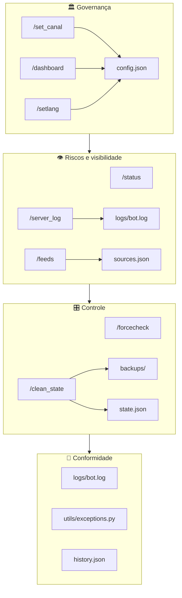

# 🛡️ Mafty Intel — Visão GRC (Governança, Riscos e Conformidade)

O **Gundam News Bot** evoluiu de um simples agregador de notícias para um **centro de controle** que cobre Governança, Visibilidade e Operação do canal. Esta página descreve o sistema sob a ótica GRC. Tudo adaptado para leitura no **GitHub** (Markdown, Mermaid, shields, links relativos).

---

## 📋 Índice

- [🎯 Por que GRC?](#por-que-grc)
- [🏛️ Governança](#governança)
- [👁️ Riscos e visibilidade](#riscos-e-visibilidade)
- [🎛️ Controle operacional](#controle-operacional)
- [📁 Rastreabilidade e conformidade](#rastreabilidade-e-conformidade)
- [📐 Diagrama GRC — comandos e arquivos](#diagrama-grc--comandos-e-arquivos)
- [📊 Resumo por comando](#resumo-por-comando)
- [🔄 Fluxo típico de uso](#fluxo-típico-de-uso)

---

## 🎯 Por que GRC?

O bot não se limita a *postar notícias*: ele permite **configurar** quem vê o quê, **monitorar** saúde e atividade, **limpar** estado com segurança e **auditar** o que aconteceu. Para um servidor Discord focado em Gundam, isso funciona como uma ferramenta de **Governança, Riscos e Conformidade** prática e integrada ao fluxo do dia a dia.

---

## 🏛️ Governança

**Objetivo:** Definir regras, canais e idioma por servidor e manter controle sobre o que é publicado.

| Recurso | Como |
|--------|------|
| 📌 **Canal de saída** | `/set_canal` ou `/dashboard` — define onde as notícias são enviadas. |
| 🎛️ **Filtros por categoria** | Dashboard ou `config.json`: Gunpla, Filmes, Games, Música, Fashion ou TUDO. |
| 🌐 **Idioma** | `/setlang` — PT-BR, EN, ES, IT, JA por servidor. |
| 🏠 **Multi-guild** | Cada servidor tem sua própria config (canal, filtros, idioma) em `config.json`. |
| 🔒 **Quem pode mudar** | Comandos administrativos exigem permissão **Administrador**. |

**Comandos:** `/set_canal`, `/dashboard`, `/setlang`

---

## 👁️ Riscos e visibilidade

**Objetivo:** Saber se o bot está saudável, o que está sendo monitorado e o que falhou.

| Recurso | Como |
|--------|------|
| 📊 **Saúde do bot** | `/status` — uptime, scans, cache hits, última varredura. |
| 📡 **Fontes ativas** | `/feeds` — lista de RSS/YouTube/sites (a partir de `sources.json`). |
| 📋 **Log do servidor** | `/server_log` — últimas N linhas de `logs/bot.log` + anexo `bot_log.txt`. |
| ⚠️ **Alertas diferenciados** | Embeds com cores/ícones: LEAK, RUMOR, atualização de sistema, HTML Monitor. |
| 🚀 **Anúncio de versão** | Mensagem automática (teal, “What changed”) quando há novo deploy. |

**Comandos:** `/status`, `/feeds`, `/server_log`, `/help`, `/about`, `/ping`

---

## 🎛️ Controle operacional

**Objetivo:** Executar ações sob demanda e manter o estado do sistema limpo e previsível.

| Recurso | Como |
|--------|------|
| 🔄 **Varredura manual** | `/forcecheck` — dispara um scan imediato sem esperar o agendamento. |
| 🧹 **Limpeza com backup** | `/clean_state` — limpa `dedup`, `http_cache`, `html_hashes` ou `tudo` em `state.json`, sempre com backup em `backups/` e confirmação. |
| 🔃 **Atualizar preview do log** | Botão **Atualizar** na mensagem do `/server_log` — atualiza o texto na mensagem (anexo `.txt` é da primeira resposta). |

**Comandos:** `/forcecheck`, `/clean_state` (+ botão no `/server_log`)

---

## 📁 Rastreabilidade e conformidade

**Objetivo:** Ter evidências do que foi feito, com logs e exceções claras.

| Recurso | Onde |
|--------|------|
| 📝 **Logs estruturados** | `logs/bot.log` — níveis INFO/WARNING/ERROR, tracebacks. |
| ⚠️ **Exceções específicas** | `utils/exceptions.py` — GundamIntelError, ConfigError, StorageError, etc. |
| 📖 **Documentação de erros** | [LOGGING_AND_EXCEPTIONS.md](LOGGING_AND_EXCEPTIONS.md) — níveis de log e uso de exceções. |
| 💾 **Backups antes de limpeza** | `/clean_state` gera backup em `backups/` antes de alterar `state.json`. |
| 🔗 **Histórico de links** | Deduplicação em `history.json` (limpeza controlada via `/clean_state tipo:dedup`). |

| Documento | Descrição |
|-----------|-----------|
| [**LOGGING_AND_EXCEPTIONS.md**](LOGGING_AND_EXCEPTIONS.md) | Logging e exceções do projeto |
| [**TUTORIAL_CLEAN_STATE.md**](TUTORIAL_CLEAN_STATE.md) | Tutorial do `/clean_state` com diagramas |
| [**ARCHITECTURE.md**](ARCHITECTURE.md) | Arquitetura, fluxo de dados e componentes |

---

## 📐 Diagrama GRC — comandos e arquivos

| Símbolo | Significado |
|--------|-------------|
| 🏛️ | Governança — canal, filtros, idioma |
| 👁️ | Visibilidade — status, feeds, log |
| 🎛️ | Controle — forcecheck, clean_state |
| 📁 | Rastreabilidade — logs, backups, exceções |

---

## 📊 Resumo por comando

| Comando | Pilar GRC | Função |
|---------|-----------|--------|
| `/set_canal` | 🏛️ Governança | Define canal de notícias |
| `/dashboard` | 🏛️ Governança | Painel de filtros e canal |
| `/setlang` | 🏛️ Governança | Idioma do servidor |
| `/forcecheck` | 🎛️ Controle | Varredura imediata |
| `/clean_state` | 🎛️ Controle + 📁 Conformidade | Limpeza com backup |
| `/server_log` | 👁️ Visibilidade + 📁 Rastreabilidade | Log + anexo `.txt` |
| `/status` | 👁️ Visibilidade | Uptime e estatísticas |
| `/feeds` | 👁️ Visibilidade | Fontes monitoradas |
| `/help`, `/about`, `/ping` | 👁️ Visibilidade | Ajuda e diagnóstico |

---

## 🔄 Fluxo típico de uso

1. **Configurar** — `/set_canal` ou `/dashboard` + `/setlang`.
2. **Monitorar** — `/status`, `/feeds`; em caso de dúvida, `/server_log` (e baixar o `bot_log.txt` se precisar de histórico).
3. **Intervir** — `/forcecheck` para forçar scan; `/clean_state` quando precisar limpar cache ou dedup (sempre com backup em `backups/`).
4. **Auditar** — Logs em `logs/bot.log`, backups em `backups/`, documentação em `docs/`.

---

## 🔗 Documentação relacionada

| Link | Conteúdo |
|------|----------|
| [**readme.md**](../readme.md) | Visão geral, instalação, comandos |
| [**COMMANDS_LIST.md**](COMMANDS_LIST.md) | Lista rápida de comandos |
| [**COMMANDS_REFERENCE.md**](COMMANDS_REFERENCE.md) | Referência completa de comandos |
| [**ARCHITECTURE.md**](ARCHITECTURE.md) | Diagramas de arquitetura e fluxo |
| [**SECURITY_GRC_ANALYSIS.md**](../analysis/SECURITY_GRC_ANALYSIS.md) | Análise de segurança (SSRF, rate limit, sanitização de logs) |
