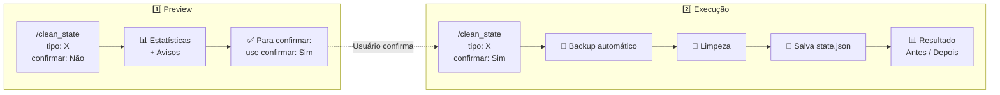
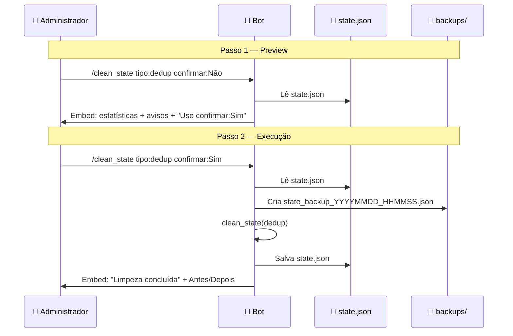

# 🧹 Tutorial: Comando `/clean_state`

[](../readme.md)
[](../readme.md#-comandos)
[](#-proteções)

Este tutorial explica **passo a passo** como usar o comando `/clean_state` para limpar o arquivo `state.json` com segurança (backup automático e confirmação obrigatória).

---

## 📋 Índice

- [O que é o `state.json`?](#-o-que-é-o-statejson)
- [Quando usar `/clean_state`?](#-quando-usar-clean_state)
- [Fluxo em 2 passos](#-fluxo-em-2-passos)
- [Diagrama do fluxo](#-diagrama-do-fluxo)
- [Tipos de limpeza](#-tipos-de-limpeza)
- [Passo a passo com exemplos](#-passo-a-passo-com-exemplos)
- [Proteções e boas práticas](#-proteções-e-boas-práticas)
- [Troubleshooting](#-troubleshooting)

---

## 📁 O que é o `state.json`?

O bot usa o arquivo `state.json` para manter:

| Parte | Função |
|-------|--------|
| **dedup** | Histórico de links já enviados por feed (evita repostar a mesma notícia). |
| **http_cache** | Cache HTTP (ETags, Last-Modified) para reduzir requisições aos feeds. |
| **html_hashes** | Hashes dos sites monitorados (HTML Watcher) para detectar mudanças. |
| **last_cleanup** | Data da última limpeza automática (ciclo de 7 dias). |

Às vezes é necessário **limpar uma ou todas** essas partes (por exemplo: histórico corrompido, cache travado, ou após mudança de configuração). O `/clean_state` faz isso de forma **controlada**, sempre com **backup** e **confirmação**.

---

## ⏰ Quando usar `/clean_state`?

| Situação | Ação sugerida |
|----------|----------------|
| Bot repostando notícias antigas ou histórico estranho | Limpar **dedup** (e conferir filtros). |
| Feeds não atualizam (304 / cache forte) | Limpar **http_cache**. |
| Monitor de sites HTML não detecta mudanças | Limpar **html_hashes**. |
| Manutenção geral ou “começar do zero” | Limpar **tudo** (use com cuidado). |

---

## 🔄 Fluxo em 2 passos

O comando **sempre** exige dois usos conscientes:

1. **Primeiro uso** — `confirmar: Não` (ou omitir): o bot **só mostra** estatísticas e avisos; **nada é apagado**.
2. **Segundo uso** — `confirmar: Sim`: o bot **cria backup**, **limpa** e **mostra antes/depois**.

Isso evita limpezas acidentais.

---

## 📐 Diagrama do fluxo





---

## 🎯 Tipos de limpeza

| Tipo no comando | Nome | O que limpa | Impacto |
|-----------------|------|--------------|---------|
| `dedup` | 🧹 Dedup | Histórico de links enviados (por feed) | ⚠️ Bot pode **repostar** notícias já enviadas |
| `http_cache` | 🌐 HTTP Cache | ETags e Last-Modified por URL | ℹ️ Mais requisições HTTP; **sem** repostagem |
| `html_hashes` | 🔍 HTML Hashes | Hashes dos sites do HTML Watcher | ⚠️ Sites serão detectados como “mudados” de novo |
| `tudo` | ⚠️ TUDO | Dedup + HTTP Cache + HTML Hashes | 🚨 Efeitos dos três; use só em emergências |

---

## 📝 Passo a passo com exemplos

### 1. Abrir o comando e escolher o tipo

No Discord, digite `/clean_state`. Você verá:

- **tipo:** escolha no menu (Dedup, HTTP Cache, HTML Hashes ou TUDO).
- **confirmar:** escolha **Não (só mostrar o que seria feito)** na primeira vez.


### 2. Ler a resposta (preview)

O bot responde com uma mensagem **só para você**, contendo:

- Tipo selecionado e **avisos** (ex.: “Isso fará o bot repostar notícias já enviadas!”).
- **Estatísticas atuais:** Dedup (feeds/links), HTTP Cache (URLs), HTML Hashes (sites), tamanho do arquivo.
- **Última limpeza automática** (se houver).
- Instrução: **“Execute novamente `/clean_state`, escolha o mesmo tipo e em confirmar selecione Sim (executar limpeza)”**.
- **Data e hora** da mensagem.

Nenhum dado é apagado neste passo.

### 3. Confirmar a limpeza

Execute de novo `/clean_state`:

- **tipo:** o **mesmo** que escolheu antes (ex.: Dedup).
- **confirmar:** **Sim (executar limpeza)**.


### 4. Resultado

O bot:

1. Cria um backup em `backups/` (ex.: `state_backup_20260220_233000.json`).
2. Limpa a parte escolhida do `state.json`.
3. Envia um embed com **Antes** e **Depois** (Dedup, HTTP Cache, HTML Hashes) e o nome do backup.

Exemplo de uso completo no chat:

```
# Passo 1 — Ver o que seria feito
/clean_state  tipo: 🧹 Dedup (Histórico de links)  confirmar: Não (só mostrar o que seria feito)

# Passo 2 — Executar
/clean_state  tipo: 🧹 Dedup (Histórico de links)  confirmar: Sim (executar limpeza)
```

---

## 🛡️ Proteções e boas práticas

| Proteção | Descrição |
|----------|-----------|
| [](#) | Antes de qualquer limpeza, o bot cria um arquivo em `backups/`. |
| [](#) | É obrigatório usar primeiro **confirmar: Não** e depois **confirmar: Sim**. |
| [](#) | Cada limpeza é registrada em log (quem, quando, tipo, antes/depois). |
| [](#) | As respostas do comando são só para você (não enchem o canal). |

Boas práticas:

- Sempre use primeiro **confirmar: Não** para ver estatísticas e avisos.
- Guarde os backups em `backups/` até ter certeza de que não precisa reverter.
- Use **tudo** só quando realmente precisar (ex.: manutenção ou reset completo).

---

## 🔧 Troubleshooting

| Problema | O que fazer |
|----------|-------------|
| “Falha ao criar backup. Limpeza cancelada” | Verifique permissões de escrita na pasta do bot e existência da pasta `backups/`. |
| “state.json está vazio ou não existe” | O bot criará o arquivo na próxima varredura; não é necessário limpar. |
| Quero desfazer a limpeza | Copie o arquivo de `backups/state_backup_*.json` de volta como `state.json` e reinicie o bot (se necessário). |

Para mais detalhes sobre cada comando, veja [COMMANDS_REFERENCE.md](COMMANDS_REFERENCE.md). Para a lista rápida de todos os comandos, veja [COMMANDS_LIST.md](COMMANDS_LIST.md).
